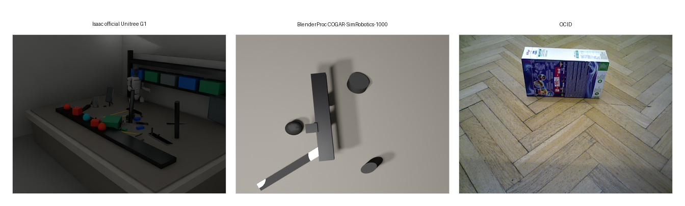
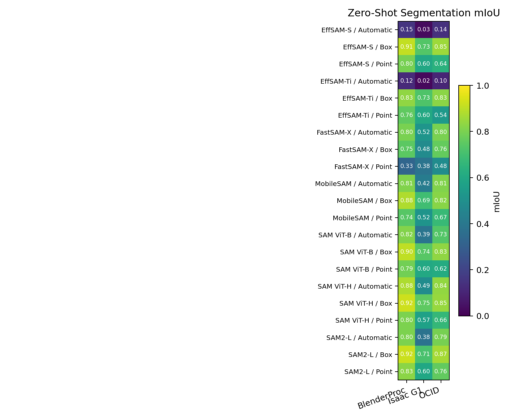
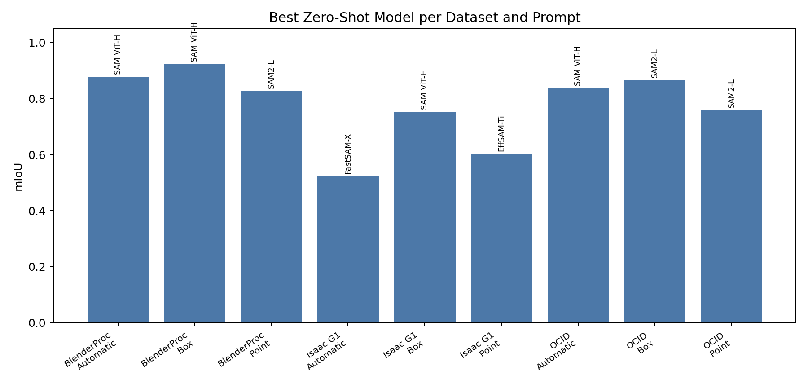
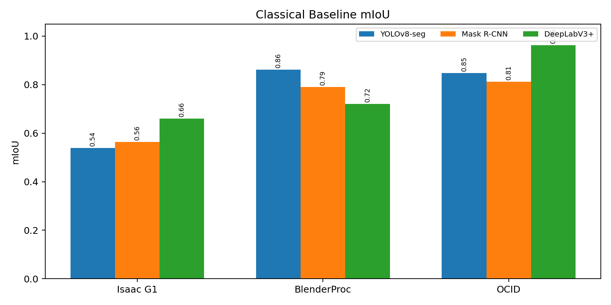
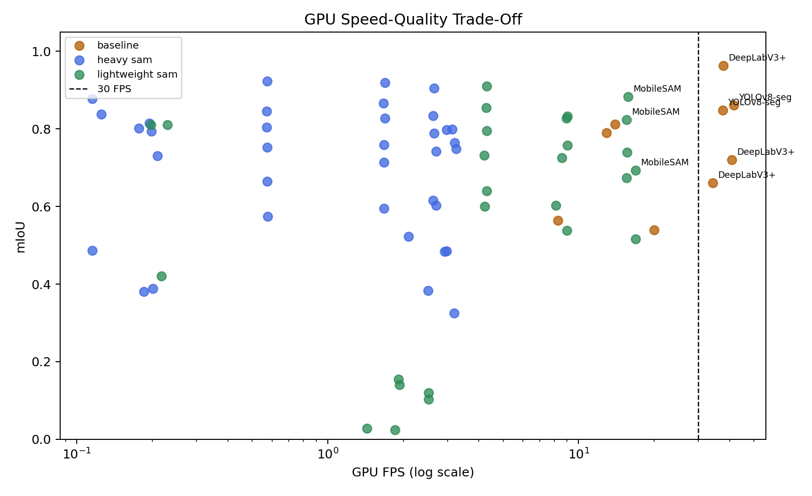
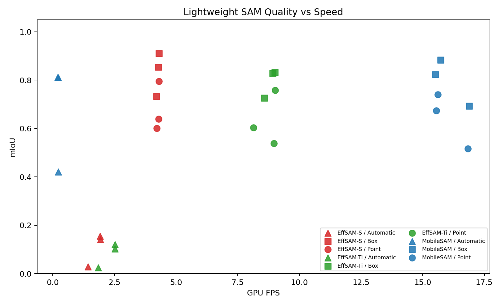
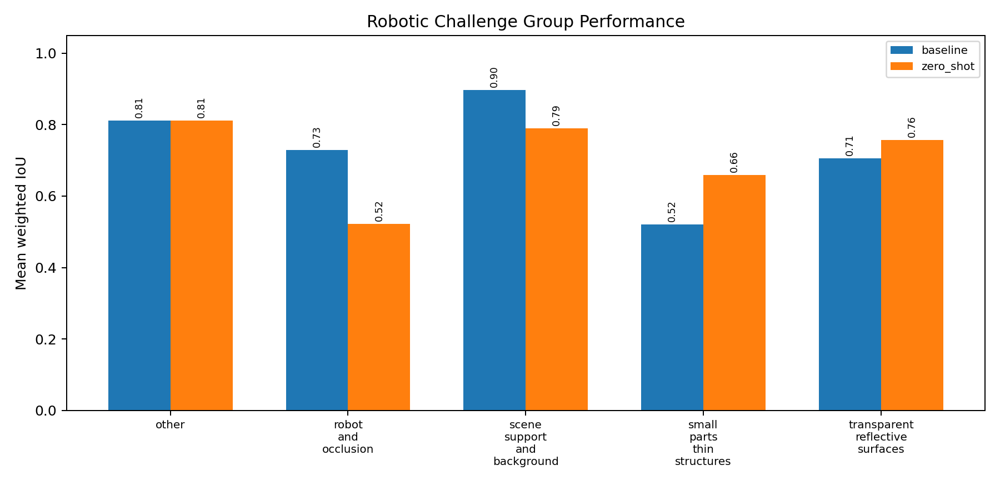
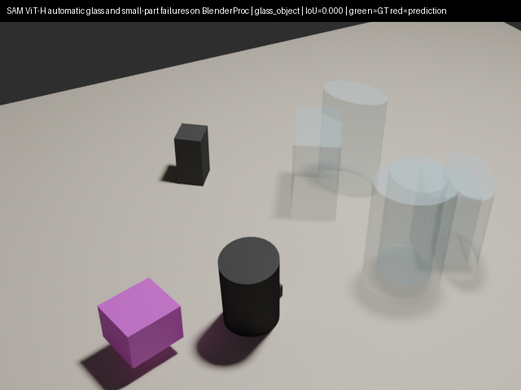

# Foundation Model Segmentation for Robotic Scenes

**Assignment:** Zero-Shot Segmentation Benchmark for Robotic Perception  
**Student id:** 5884715  

## Abstract

This project investigates whether promptable foundation segmentation models can
serve as reliable perception modules for robotic scene understanding. The
benchmark focuses on visual conditions that are common in robotics but difficult
for generic image segmentation: reflective metal, transparent glass, partial
occlusion, small screws and connectors, clutter, robot-body visibility, and
dynamic objects.

The study evaluates SAM ViT-H, SAM ViT-B, SAM2, FastSAM, MobileSAM, and
EfficientSAM in zero-shot settings with point prompts, box prompts, and
automatic mask generation where applicable. It compares them with supervised
baselines trained on small labeled subsets: YOLOv8-seg, Mask R-CNN, and
DeepLabV3+. The datasets include an Isaac Sim Unitree G1 synthetic dataset, a
BlenderProc COGAR-SimRobotics synthetic dataset, and OCID as a real clutter
reference.

The conclusion is conditional. Foundation segmentation models are useful for
robotic perception, especially when a robot or upstream module can provide a
reliable target prompt. They are not complete robotic perception systems by
themselves. Deployment still requires prompt generation, temporal consistency,
domain validation, inference-speed analysis, and explicit handling of failure
cases.

## Report Structure and Supporting Files

This root report is the final research report. The supporting files under
`report/` are concise companion pages for presentation preparation and
traceability. Reusable plots and CSV evidence are centralized in one catalog so
the same figures are not repeated across every support file.

| Main report section | Detailed supporting file | What the supporting file contains |
| --- | --- | --- |
| Research Problem | [report/01_research_problem.md](report/01_research_problem.md) | Expanded motivation, robotics-specific difficulty, research gap, research question, and slide-ready explanation. |
| State of the Art | [report/02_state_of_the_art.md](report/02_state_of_the_art.md) | Detailed background on SAM, SAM2, FastSAM, MobileSAM, EfficientSAM, supervised baselines, simulation, and the robotic perception gap. |
| Research Formulation | [report/03_research_formulation.md](report/03_research_formulation.md) | Objectives, hypotheses, variables, methodology, evaluation design, and rules for fair conclusions. |
| Cognitive Approach | [report/04_cognitive_approach.md](report/04_cognitive_approach.md) | Full COGAR interpretation: segmentation as attention, object representation, perception-action support, and real-time cognition. |
| Congruence of Results and Conclusions | [report/05_results_congruence_and_conclusions.md](report/05_results_congruence_and_conclusions.md) | Detailed result-to-conclusion mapping, hypothesis checks, limitations, failure-mode interpretation, and recommendation logic. |
| Visual evidence catalog | [report/figures_and_tables.md](report/figures_and_tables.md) | Shared figure, table, and representative failure references used by the report and support files. |
| Presentation | [report/06_slide_deck_outline.md](report/06_slide_deck_outline.md) | Slide-by-slide presentation plan aligned with the required lecture structure. |
| References | [report/references.md](report/references.md) | Source map explaining where each reference supports the report and presentation. |

A repository-local wiki version is also provided under [docs/wiki/](docs/wiki/).

## Numerical Results at a Glance

The main numerical results are summarized here before the detailed discussion.

| Result category | Dataset | Best model / setting | mIoU | Boundary F1 | Mask AP | CUDA FPS |
| --- | --- | --- | ---: | ---: | ---: | ---: |
| Best quality | BlenderProc | SAM ViT-H, box prompt | 0.923 | 0.905 | 0.868 | 0.574 |
| Best quality | Isaac G1 | SAM ViT-H, box prompt | 0.752 | 0.874 | 0.678 | 0.574 |
| Best quality | OCID | DeepLabV3+ | 0.963 | 0.880 | N/A | 37.811 |
| Best speed-quality trade-off | BlenderProc | YOLOv8-seg | 0.861 | 0.814 | 0.643 | 41.647 |
| Best speed-quality trade-off | Isaac G1 | DeepLabV3+ | 0.660 | 0.664 | N/A | 34.332 |
| Best speed-quality trade-off | OCID | DeepLabV3+ | 0.963 | 0.880 | N/A | 37.811 |
| Best lightweight box-prompt trade-off | BlenderProc | MobileSAM | 0.883 | 0.873 | 0.757 | 15.737 |
| Best lightweight box-prompt trade-off | Isaac G1 | MobileSAM | 0.693 | 0.821 | 0.560 | 16.895 |
| Best lightweight box-prompt trade-off | OCID | MobileSAM | 0.824 | 0.740 | 0.688 | 15.522 |

Dataset scale:

| Dataset | Images | COCO annotations / instances |
| --- | ---: | ---: |
| Isaac official Unitree G1 | 1000 | 72,695 |
| BlenderProc COGAR-SimRobotics-1000 | 1000 | 8,768 |
| OCID | 2390 | 21,487 |

Available output artifacts:

| Artifact group | Rows / files | Evidence path |
| --- | ---: | --- |
| Heavy zero-shot quality summaries | 36 rows | `outputs/task6_evaluation/zero_shot/summary.csv` |
| Supervised baseline summaries | 9 rows | `outputs/task6_evaluation/baselines/summary.csv` |
| GPU/CPU speed measurements | 90 rows | `outputs/task7_inference_speed/summary.csv` |
| Lightweight SAM quality rows | 72 rows | `outputs/task9_lightweight_sam/summary/lightweight_quality.csv` |
| Lightweight speed-quality rows | 144 rows | `outputs/task9_lightweight_sam/summary/speed_quality_tradeoff.csv` |
| Challenge-group failure rows | 151 rows | `outputs/task8_failure_analysis/challenge_group_summary.csv` |
| Representative failure overlays | 10 images | `outputs/task8_failure_analysis/figures/` |
| Final plots | 7 images | `outputs/final_benchmark_assets/plots/` |

The full numerical discussion is in Section 5, where the results are connected
to model-selection conclusions.

---

## 1. Research Problem

Detailed supporting file: [report/01_research_problem.md](report/01_research_problem.md).

Robots need object-level scene understanding before they can manipulate,
inspect, avoid, track, or reason about objects. In this context, a segmentation
mask is not only an image-processing output. It can become an intermediate
object representation used by a grasp planner, tracker, navigation module,
inspection system, or higher-level cognitive architecture.

The scientific problem is that general-purpose foundation segmentation models
are usually validated on broad image distributions, while robotic perception
has different operational constraints. Robotic scenes contain material effects,
close-range viewpoints, robot-body occlusions, clutter, small task-relevant
parts, and runtime limits that can make a visually plausible mask unusable for
action.

The central research question is:

> To what extent can promptable foundation segmentation models provide reliable
> zero-shot object masks for robotic scene understanding in challenging
> simulated environments, and what trade-offs appear against lightweight and
> supervised alternatives in accuracy, robustness, prompt dependence, and
> real-time feasibility?

This question is decomposed into four subquestions:

| Subquestion | Purpose |
| --- | --- |
| RQ1: Mask quality | Which SAM-family models produce the most accurate masks under point, box, and automatic prompting? |
| RQ2: Robotic robustness | Which models fail on reflective, transparent, occluded, small-part, dynamic, and robot-centered scenes? |
| RQ3: Deployment feasibility | Which models are fast enough on GPU/CPU to be plausible for robotic use? |
| RQ4: Model-selection trade-off | When should a robot use a heavy zero-shot model, a lightweight SAM variant, or a small supervised baseline? |

The project therefore does not search for one universal winner. It evaluates
segmentation as a robotic perception module whose usefulness depends on the
task context: high-quality offline perception, prompt-guided manipulation,
automatic object proposal generation, real-time control, or edge deployment.

The scope is intentionally limited to segmentation quality, robustness, and
runtime. The benchmark does not claim to solve full robotic scene understanding,
because downstream pose estimation, tracking, uncertainty handling, planning,
and action execution would require additional evaluation.

---

## 2. State of the Art

Detailed supporting file: [report/02_state_of_the_art.md](report/02_state_of_the_art.md).

The literature can be organized into five benchmark-relevant streams, with one
recent frontier beyond the experimental scope: promptable foundation
segmentation, temporal segmentation, lightweight SAM-style models, supervised
task-specific baselines, simulation-based robotic perception, and newer
concept/3D segment-anything work. The important gap for this project is not
whether modern segmentation models can produce good masks on general images.
The gap is whether they are reliable enough to serve as perception modules in
embodied robotic scenes.

| Research stream | Representative methods | Main contribution | Limitation for robotics |
|---|---|---|---|
| Promptable foundation segmentation | SAM, SAM ViT-H, SAM ViT-B | Zero-shot masks from point, box, or automatic prompts | Requires reliable prompting and can be expensive |
| Temporal foundation segmentation | SAM2 | Extends promptable segmentation toward image and video streams | Single-frame scores do not fully prove temporal stability |
| Efficient SAM variants | FastSAM, MobileSAM, EfficientSAM | Reduce latency, memory, or encoder cost | Can lose boundary accuracy, small-object quality, or robustness |
| Supervised baselines | Mask R-CNN, DeepLabV3+, YOLOv8-seg | Strong performance after target-domain fine-tuning | Requires labeled data and is less open-vocabulary/zero-shot |
| Simulation and robotic datasets | Isaac Sim, BlenderProc, OCID-style clutter data | Controlled annotations and targeted robotic challenges | Synthetic scenes still have a sim-to-real gap |
| Recent frontier beyond this benchmark | SAM3, SAM3D-style work | Concept prompting, tracking, and physical-world 3D structure | Outside the controlled 2D assignment scope |

### 2.1 Promptable foundation segmentation

Segment Anything Model (SAM) introduced segmentation as a promptable foundation
task. Instead of training a separate model for every object category or
environment, SAM accepts prompts such as foreground points, boxes, or masks and
returns candidate object masks. This is relevant to robotics because robots
frequently encounter previously unseen tools, parts, containers, and workspace
layouts where dense manual annotation is expensive.

SAM2 extends the same direction from static images toward videos through a
streaming-memory design. This matters for robotics because robot perception is
normally continuous: objects move, the robot moves, occlusions appear and
disappear, and perception must support object persistence over time. More recent
concept-prompted and 3D segment-anything research continues this trend toward
recognition, tracking, and physical-world reconstruction, but this project keeps
the experimental scope fixed to the assignment models: SAM, SAM2, FastSAM,
MobileSAM, and EfficientSAM.

### 2.2 Lightweight SAM variants

Full SAM-style models are often too heavy for onboard robotic use. Mobile
robots and humanoid platforms have strict limits on latency, memory, power, and
thermal budget. FastSAM, MobileSAM, and EfficientSAM address this deployment
problem from different directions.

FastSAM uses a faster instance-segmentation-style pipeline with prompt-guided
mask selection. MobileSAM keeps the SAM-style prompt interface while replacing
the heavy encoder with a smaller one. EfficientSAM builds compact promptable
models using efficient pretraining. In this benchmark they are not treated as
secondary models; they directly answer whether SAM-style segmentation can be
realistic for edge-oriented robotic perception.

### 2.3 Classical supervised baselines

Classical supervised segmentation remains important because practical robots do
not always need pure zero-shot behavior. If a small amount of target-domain data
is available, a trained model can be faster and more predictable than a large
foundation model. Mask R-CNN is a standard instance-segmentation baseline,
DeepLabV3+ is a strong semantic-segmentation architecture with boundary-aware
dense prediction, and YOLOv8-seg is a practical real-time instance-segmentation
baseline.

These baselines answer a different question from SAM-style models. SAM-family
models test generalization without task-specific training, while supervised
baselines test what can be achieved after limited domain adaptation. For a fair
scientific comparison, this report therefore separates validation used for
checkpoint selection from held-out test data used for final evaluation.

### 2.4 Simulation and robotic perception datasets

Simulation is central to this assignment because robotic segmentation needs
ground truth for difficult conditions that are expensive to annotate manually.
Isaac Sim and BlenderProc make it possible to control robot pose, camera
viewpoint, lighting, material properties, clutter, occlusion, and object motion
while exporting annotations. OCID-style real clutter data is useful as a
complement because it exposes how conclusions from simulation may change under
real visual clutter.

The weakness of simulation is the sim-to-real gap. Photorealistic rendering and
domain randomization reduce this gap, but they do not remove it. For that
reason, the report treats simulation results as controlled evidence about model
behavior under robotic challenges, not as a complete proof of real-world
deployment performance.

### 2.5 State-of-the-art gap addressed by this benchmark

General segmentation benchmarks usually emphasize mask quality on natural-image
datasets. Robotic perception adds stricter requirements: reflective metal,
transparent glass, small screws and connectors, partial occlusion, moving
objects, robot-body visibility, and real-time inference. A segmentation error is
therefore not only a visual error; it can affect grasping, collision checking,
tracking, navigation, or human-robot interaction.

This project addresses the gap by evaluating segmentation models as candidate
modules inside a robotic cognitive architecture. The benchmark combines
standard mask metrics, per-challenge analysis, runtime measurement, and
qualitative failure modes so that the final recommendation is based on robotic
usefulness rather than only generic image-segmentation accuracy.

---

## 3. Research Formulation

Detailed supporting file: [report/03_research_formulation.md](report/03_research_formulation.md).

### 3.1 Objectives

The objectives are:

1. Create and curate robotic-scene datasets with segmentation annotations.
2. Include reflective metal, transparent glass, partial occlusion, small parts,
   and moving/dynamic objects.
3. Use simulation environments such as Isaac Sim and BlenderProc.
4. Use a simulated robotic platform, especially Unitree G1, to make the main
   dataset robot-centered.
5. Run SAM ViT-H, SAM ViT-B, SAM2, FastSAM, MobileSAM, and EfficientSAM in
   zero-shot mode.
6. Evaluate point prompts, box prompts, and automatic mask generation.
7. Train YOLOv8-seg, Mask R-CNN, and DeepLabV3+ on small labeled subsets.
8. Measure mIoU, boundary F1, mask AP, AP50, AP75, per-category IoU, and
   challenge-group behavior.
9. Measure GPU and CPU inference speed.
10. Analyze qualitative failure modes and produce model-selection
    recommendations.

### 3.2 Hypotheses

| Hypothesis | Expected behavior |
| --- | --- |
| H1 | Prompted segmentation should be more reliable than automatic mask generation because a target cue reduces ambiguity. |
| H2 | Box prompts should generally outperform point prompts because they provide stronger spatial constraints. |
| H3 | Large SAM-family models should provide strong quality but weak real-time feasibility. |
| H4 | Lightweight SAM variants should improve deployment feasibility but may lose quality on difficult boundaries and clutter. |
| H5 | Supervised baselines can be more practical for real-time robotic loops when labeled target-domain data is available. |
| H6 | Transparent, reflective, occluded, small, and dynamic objects should remain high-risk failure cases. |

### 3.3 Dataset design

The benchmark uses two generated synthetic datasets and one real clutter
reference dataset.

| Dataset | Type | Role | Images |
| --- | --- | --- | ---: |
| Isaac official Unitree G1 | Synthetic, Isaac Sim | Main robot-centered simulation benchmark | 1000 |
| BlenderProc COGAR-SimRobotics-1000 | Synthetic, BlenderProc | Controlled synthetic challenge benchmark | 1000 |
| OCID | Real RGB-D clutter dataset | Real-world clutter and domain-gap reference | 2390 |

The Isaac dataset uses the official Unitree G1 asset and contains robot-centered
scenes. This is important because the benchmark is not only about generic
object segmentation. It tests segmentation in the visual context of a robot
workspace.

### 3.4 Experimental protocol

The benchmark protocol was fixed before final comparison so that the reported
numbers describe the same evaluation setting across model families.

| Protocol component | Configuration used in the benchmark |
| --- | --- |
| Student identifier / seed | 5884715 |
| Main simulation dataset | Isaac Sim official Unitree G1 dataset, 1000 annotated RGB images |
| Additional synthetic dataset | BlenderProc COGAR-SimRobotics-1000, 1000 annotated RGB images |
| Domain-gap reference | OCID real clutter dataset, 2390 converted COCO images |
| Robotic challenges | reflective metal, transparent glass, partial occlusion, small parts, thin cables/connectors, robot-body occlusion, dynamic/moving objects |
| Supervised training subset | 100 images per dataset |
| Validation subset | 50 images per dataset, used for supervised checkpoint selection |
| Final test subset | held-out test images only: 850 Isaac, 850 BlenderProc, 2240 OCID |
| Zero-shot models | SAM ViT-H, SAM ViT-B, SAM2 Hiera-Large, FastSAM-X |
| Lightweight zero-shot models | MobileSAM ViT-T, EfficientSAM-Ti, EfficientSAM-S |
| Supervised baselines | YOLOv8-seg, Mask R-CNN, DeepLabV3+ |
| Prompt modes | point prompt, box prompt, automatic mask generation |
| Quality metrics | mIoU, boundary F1, mask AP, AP50, AP75, per-category IoU, challenge-group IoU |
| Speed metrics | FPS and mean latency on CUDA and CPU |
| Output evidence | CSV summaries, JSON metrics, plots, and representative failure overlays under `outputs/` |

The split policy is summarized below.

| Dataset | Train images | Validation images | Test images |
| --- | ---: | ---: | ---: |
| Isaac official Unitree G1 | 100 | 50 | 850 |
| BlenderProc COGAR-SimRobotics-1000 | 100 | 50 | 850 |
| OCID | 100 | 50 | 2240 |

Fairness policy: supervised baselines and zero-shot foundation models are not
the same learning setting, so they are interpreted separately and compared only
on the same held-out test image IDs. The 50-image validation subsets are used
only for supervised checkpoint selection. They are not used as final test
evidence. When zero-shot prediction files cover more than the test subset, the
metric scripts filter them to the reserved test IDs before writing the final
summary tables.

### 3.5 Hardware, software, and timing conditions

The inference-speed measurements were recorded with the environment metadata
stored in the speed JSON files. This is important because FPS is hardware- and
implementation-dependent.

| Component | Recorded setting |
| --- | --- |
| Operating system | Linux `6.17.0-1017-aws`, x86_64 |
| GPU device | NVIDIA Tesla T4 |
| GPU memory | 15.64 GB |
| CPU | x86_64, 4 logical cores / 2 physical cores |
| System memory | 16.55 GB |
| Python | 3.12.3 |
| PyTorch | 2.5.1+cu121 |
| CUDA availability | enabled for CUDA timing rows |
| Main timing evidence | `outputs/task7_inference_speed/summary.csv` and `outputs/task9_lightweight_sam/inference_speed/summary.csv` |

The timing protocol used single-image inference rather than batched
throughput. For the heavy Task 7 timing runs, CUDA point/box/baseline rows used
50 timed images, CUDA automatic rows used 20 timed images, CPU point/box and
baseline rows used 3 timed images, and CPU automatic rows used 1 timed image.
For the lightweight Task 9 timing runs, CUDA point/box rows used 50 timed
images, CUDA automatic rows used 20 timed images, CPU point/box rows used 10
timed images, and CPU automatic rows used 1 timed image. Each output row stores
the actual `sample_images`, `warmup_units`, and `timed_units` values.

For image handling, SAM-family models were timed on native RGB dataset images
with their own model preprocessing. The supervised baselines used their
configured inference resolutions: YOLOv8-seg at image size 640, DeepLabV3+ at
512×512, and Mask R-CNN with a 640/1024 min/max resize policy. Reported FPS
therefore measures the practical benchmark pipeline used in this repository,
not a model-only synthetic microbenchmark.

### 3.6 Model and prompt protocol

| Group | Models | Evaluation mode |
| --- | --- | --- |
| Heavy zero-shot models | SAM ViT-H, SAM ViT-B, SAM2, FastSAM | Point, box, automatic |
| Lightweight SAM variants | MobileSAM, EfficientSAM-Ti, EfficientSAM-S | Point, box, automatic/grid automatic |
| Supervised baselines | YOLOv8-seg, Mask R-CNN, DeepLabV3+ | Inference after small-subset training |

Point and box prompt results are oracle-prompt evaluations. The prompts are
derived from ground-truth masks and boxes to isolate segmentation quality once a
target cue is available. In a deployed robot, such prompts would need to come
from an upstream detector, tracker, planner, human operator, or task prior.

Automatic mask generation is closer to prompt-free object discovery. It is more
autonomous but less controlled and often slower.

### 3.7 Implementation choices and deviations

The implementation follows the assignment requirements, with a few practical
choices made for reproducibility and compatibility with the existing PyTorch
benchmark code.

| Assignment expectation | Implementation in this repository | Rationale |
| --- | --- | --- |
| Use Isaac Sim, Gazebo, and/or Rviz2 | Isaac Sim is the primary simulator; BlenderProc is used as a secondary controlled synthetic-data generator. Gazebo/Rviz2 are not used in the final benchmark. | The assignment states Isaac Sim is preferred. Isaac Sim provides the robot-centered Unitree G1 dataset, while BlenderProc adds controlled material/challenge diversity. |
| Use Unitree As2 EDU or Unitree G1 EDU | The main robot-centered simulation dataset uses the official Unitree G1 asset. | This satisfies the requested simulated robotic-platform condition with the humanoid G1 platform. |
| Detectron2 listed in the expected software stack | Mask R-CNN is implemented with TorchVision `maskrcnn_resnet50_fpn`, initialized from COCO weights. Detectron2 is not used in the final code path. | The evaluated baseline is still the requested Mask R-CNN model family. TorchVision keeps the training/evaluation pipeline inside the same PyTorch environment and avoids adding a second framework for the same baseline category. |
| Run YOLOv8-seg baseline | YOLOv8-seg is implemented through Ultralytics and trained on the small supervised subsets. | This directly covers the requested YOLOv8-seg comparison. |
| Run DeepLabV3+ baseline | DeepLabV3+ is implemented through `segmentation-models-pytorch` with a ResNet-34 encoder. | This covers the requested semantic-segmentation baseline while keeping the setup lightweight. |
| Run FastSAM | FastSAM is loaded from a local source checkout under `external/FastSAM`. | The FastSAM repository is imported directly by the benchmark script, which is more stable than treating it as a normal PyPI dependency. |
| Use about 500 annotated simulation images | The benchmark uses 1000 Isaac images and 1000 BlenderProc images, plus OCID as a real clutter reference. | The synthetic benchmark exceeds the requested scale; OCID is added only as a domain-gap reference, not as a replacement for simulation. |

These choices do not change the benchmark question. They clarify which software
implementation was used for each required model family and avoid implying that
Detectron2, Gazebo, or Rviz2 were part of the final measured results.

### 3.8 Metrics

The evaluation uses:

- **mIoU** for region overlap,
- **boundary F1** for contour quality,
- **mask AP / AP50 / AP75** for instance-level segmentation,
- **per-category IoU** for object-specific performance,
- **challenge-group IoU** for robotic robustness,
- **FPS and latency** for deployment feasibility,
- **qualitative overlays** for failure interpretation.

Final comparative evaluation uses a common held-out test protocol so that
zero-shot models and supervised baselines are compared on the same reserved
image IDs.

### 3.9 Alignment with the assignment specification

The project covers the nine requested assignment components as follows:

| Assignment item | Coverage in this project |
| --- | --- |
| Simulated annotated robotic scenes | Isaac Unitree G1 and BlenderProc datasets exceed the requested 500-image scale; OCID is added as a real clutter reference. |
| Robotic simulation environment | Isaac Sim is the primary simulator; BlenderProc is used as a secondary controlled synthetic-data pipeline. |
| Simulated robotic platform | Unitree G1 is used in the main Isaac dataset to create robot-centered scenes. |
| SAM/SAM2/FastSAM zero-shot benchmark | SAM ViT-H, SAM ViT-B, SAM2, and FastSAM are evaluated with point, box, and automatic prompts. |
| Classical baselines | YOLOv8-seg, TorchVision Mask R-CNN, and DeepLabV3+ are trained on small labeled subsets. |
| Standard metrics | mIoU, boundary F1, mask AP, AP50/AP75, per-category IoU, and challenge-group IoU are reported. |
| Inference speed | GPU and CPU FPS/latency are measured to assess real-time feasibility. |
| Failure analysis | Qualitative overlays and challenge-group summaries identify failures on transparent, reflective, occluded, small, dynamic, and cluttered cases. |
| Lightweight SAM variants | MobileSAM and EfficientSAM variants are evaluated as edge-deployment trade-offs. |

---

## 4. Cognitive Approach

Detailed supporting file: [report/04_cognitive_approach.md](report/04_cognitive_approach.md).

This project is connected to Cognitive Architectures for Robotics because
segmentation is treated as a perception module inside an embodied cognitive
system, not as an isolated image-processing output.

A cognitive robotic architecture must transform raw sensory input into
representations that support attention, memory, reasoning, planning, and
action. Segmentation masks are one such intermediate representation. They
convert pixels into object-level regions that can be used for:

- selecting a task-relevant object,
- tracking object state,
- estimating graspable regions,
- separating object from background,
- reasoning about occlusion,
- checking collision or free space,
- linking perception to symbolic or task-level representations.

| COGAR concept | Connection to this project |
| --- | --- |
| Embodiment | The main dataset uses robot-centered Unitree G1 simulation. |
| Situated perception | Models are tested in clutter, occlusion, material effects, robot-body visibility, and dynamic scenes. |
| Attention | Point and box prompts represent task-driven attention cues. |
| Scene representation | Masks provide object-level regions for downstream reasoning. |
| Perception-action loop | Mask errors can affect grasping, tracking, navigation, and planning. |
| Real-time cognition | FPS and latency determine whether segmentation can run inside a control loop. |
| Robustness | Failure analysis identifies conditions where perception becomes unreliable for action. |

Point prompts can be interpreted as minimal attentional signals. Box prompts are
stronger top-down priors. Automatic mask generation represents bottom-up scene
parsing. This distinction matters because robotic perception is usually
goal-directed: the robot perceives in relation to a task, an action, or an
uncertainty that must be resolved.

---

## 5. Congruence of Results and Conclusions

Detailed supporting file: [report/05_results_congruence_and_conclusions.md](report/05_results_congruence_and_conclusions.md).

This section connects the obtained results to the final conclusions. The goal is
to avoid overclaiming. The results support conditional recommendations rather
than a universal statement that one model is always best.

All final quality tables in this section use held-out test summaries. Supervised
baseline validation scores are excluded from these comparisons because those
validation images were used for checkpoint selection. Therefore, the reported
supervised-versus-zero-shot comparisons reflect test-set behavior, not
validation-set tuning.

### 5.1 Segmentation quality

The aggregate benchmark results show that box-prompted large SAM models provide
the strongest quality on the synthetic datasets. In the final benchmark asset
tables, SAM ViT-H with box prompts is the best CUDA-quality model on
BlenderProc and Isaac.

| Dataset | Best quality model | Prompt | mIoU | Boundary F1 | Mask AP | CUDA FPS |
| --- | --- | --- | ---: | ---: | ---: | ---: |
| BlenderProc | SAM ViT-H | Box | 0.923 | 0.905 | 0.868 | 0.574 |
| Isaac G1 | SAM ViT-H | Box | 0.752 | 0.874 | 0.678 | 0.574 |
| OCID | DeepLabV3+ | Inference | 0.963 | 0.880 | N/A | 37.811 |

The best zero-shot model for each dataset and prompt mode is:

| Dataset | Prompt mode | Best model | mIoU | Boundary F1 | Mask AP |
| --- | --- | --- | ---: | ---: | ---: |
| BlenderProc | Automatic | SAM ViT-H | 0.878 | 0.855 | 0.581 |
| BlenderProc | Box | SAM ViT-H | 0.923 | 0.905 | 0.868 |
| BlenderProc | Point | SAM2 Hiera-Large | 0.827 | 0.822 | 0.751 |
| Isaac G1 | Automatic | FastSAM-X | 0.523 | 0.600 | 0.256 |
| Isaac G1 | Box | SAM ViT-H | 0.752 | 0.874 | 0.678 |
| Isaac G1 | Point | EfficientSAM-Ti | 0.603 | 0.688 | 0.510 |
| OCID | Automatic | SAM ViT-H | 0.838 | 0.776 | 0.396 |
| OCID | Box | SAM2 Hiera-Large | 0.866 | 0.787 | 0.776 |
| OCID | Point | SAM2 Hiera-Large | 0.759 | 0.737 | 0.612 |

This supports H1 and H2: prompt cues matter, and box prompts are especially
effective because they provide stronger spatial information than a single
point.

The conclusion must remain precise. Strong box-prompt results do not mean that
the model performs fully autonomous object discovery. They mean that the model
segments well when a target region is supplied by an oracle or upstream robotic
module.

### 5.2 Supervised baselines and real-time feasibility

Large SAM models provide strong quality but are slow in the recorded speed
tests. SAM ViT-H with box prompts is below 1 FPS on CUDA. This makes it more
suitable for offline analysis, high-level planning, or human-guided operation
than for fast closed-loop control.

The best speed-quality trade-off results show why supervised baselines remain
important.

| Dataset | Best CUDA trade-off | mIoU | CUDA FPS | Interpretation |
| --- | --- | ---: | ---: | --- |
| BlenderProc | YOLOv8-seg | 0.861 | 41.647 | Strong real-time instance segmentation after supervision |
| Isaac G1 | DeepLabV3+ | 0.660 | 34.332 | Real-time semantic segmentation on the robot-centered dataset |
| OCID | DeepLabV3+ | 0.963 | 37.811 | Strong real-time semantic segmentation on clutter scenes |

The fastest CUDA runs in the available output summaries are:

| Dataset | Model | Mode | FPS | Mean latency |
| --- | --- | --- | ---: | ---: |
| BlenderProc | YOLOv8-seg | Inference | 41.647 | 24.0 ms |
| BlenderProc | DeepLabV3+ | Inference | 40.900 | 24.5 ms |
| OCID | DeepLabV3+ | Inference | 37.811 | 26.4 ms |
| OCID | YOLOv8-seg | Inference | 37.517 | 26.7 ms |
| Isaac G1 | DeepLabV3+ | Inference | 34.332 | 29.1 ms |
| Isaac G1 | YOLOv8-seg | Inference | 19.967 | 50.1 ms |
| OCID | Mask R-CNN | Inference | 13.970 | 71.6 ms |
| BlenderProc | Mask R-CNN | Inference | 12.935 | 77.3 ms |

This supports H3 and H5. Large foundation models are strong but expensive.
Supervised baselines can be more practical when labeled target-domain data is
available and the robot needs high FPS.

### 5.3 Lightweight SAM variants

Lightweight SAM variants provide a middle ground between heavy promptable
foundation models and supervised real-time baselines.

| Dataset | Best lightweight prompted model | Prompt | mIoU | CUDA FPS | Checkpoint size |
| --- | --- | --- | ---: | ---: | ---: |
| BlenderProc | MobileSAM | Box | 0.883 | 15.737 | 40.73 MB |
| Isaac G1 | MobileSAM | Box | 0.693 | 16.895 | 40.73 MB |
| OCID | MobileSAM | Box | 0.824 | 15.522 | 40.73 MB |

The Task 9 output contains 72 lightweight quality rows and 144 joined
speed-quality rows. None of the lightweight SAM variants reached 30 FPS in the
recorded joined benchmark, but MobileSAM box prompting provided the best
practical mIoU-FPS product on the three datasets.

This supports H4. MobileSAM and EfficientSAM are useful for edge-oriented
promptable perception, but they should be selected by explicit speed-quality
trade-off rather than assumed to preserve the full capability of larger SAM
models.

### 5.4 Robotic challenge groups and failure modes

Average metrics do not fully describe robotic reliability. A robot may fail if
it misses a small connector, merges a transparent object with the background,
segments a reflection instead of the object, or confuses a robot part with an
external tool.

The failure analysis identifies the highest-risk groups:

| Challenge group | Why it matters for robotics |
| --- | --- |
| Small parts and thin structures | Screws, cables, and connectors are important for assembly and inspection but occupy few pixels. |
| Transparent and reflective surfaces | Glass and metal can weaken or distort visual boundaries. |
| Robot body and occlusion | The robot can occlude the scene or visually merge with task objects. |
| Dynamic objects | Motion can break single-frame segmentation and tracking assumptions. |
| Cluttered support surfaces | Workbenches and bins increase ambiguity and object merging. |

The weakest challenge-group rows in the output summaries are:

| Dataset | Model | Prompt | Challenge group | Weighted IoU | Mean boundary F1 |
| --- | --- | --- | --- | ---: | ---: |
| Isaac G1 | FastSAM-X | Point | Robot and occlusion | 0.174 | 0.576 |
| Isaac G1 | SAM2 Hiera-Large | Automatic | Robot and occlusion | 0.181 | 0.611 |
| BlenderProc | FastSAM-X | Point | Robot and occlusion | 0.192 | 0.228 |
| Isaac G1 | SAM ViT-B | Automatic | Robot and occlusion | 0.209 | 0.629 |
| BlenderProc | FastSAM-X | Point | Small parts / thin structures | 0.245 | 0.299 |
| BlenderProc | FastSAM-X | Point | Transparent / reflective surfaces | 0.317 | 0.342 |

Representative failure overlays include zero-IoU examples for screws, cables,
robot-body regions, glass objects, and OCID clutter objects:

| Dataset | Model | Prompt | Category | IoU |
| --- | --- | --- | --- | ---: |
| Isaac G1 | FastSAM-X | Point | screw | 0.000 |
| Isaac G1 | FastSAM-X | Point | cable | 0.000 |
| Isaac G1 | SAM ViT-B | Automatic | screw | 0.000 |
| Isaac G1 | SAM ViT-B | Automatic | robot | 0.000 |
| BlenderProc | SAM ViT-H | Automatic | glass_object | 0.000 |
| OCID | FastSAM-X | Automatic | object | 0.000 |

This supports H6. Robotic deployment requires additional validation for
materials, occlusion, small objects, and motion.

### 5.5 Prompt-mode interpretation

The benchmark also shows why prompt mode must be interpreted carefully.

| Prompt mode | Robotic interpretation | Main conclusion |
| --- | --- | --- |
| Point | Minimal attention cue | Useful but ambiguous in clutter |
| Box | Strong task or detector prior | Best quality when target region is available |
| Automatic | Bottom-up proposal generation | More autonomous but slower and less controlled |

The strongest conclusion is not that foundation models replace robotic
perception. The supported conclusion is that they can become useful perception
modules when integrated with prompt generation, validation, and task context.

### 5.6 Final recommendations

| Robotic scenario | Recommended model family | Reason |
| --- | --- | --- |
| Highest mask quality, offline or high-level planning | SAM ViT-H / SAM2 with box prompts | Strong mask quality when latency is acceptable |
| Prompt-guided manipulation | SAM/SAM2/MobileSAM with box prompts | Box prompts represent task-driven attention and reduce ambiguity |
| Real-time control with labeled data | YOLOv8-seg or DeepLabV3+ | Higher FPS after target-domain supervision |
| Edge-oriented promptable perception | MobileSAM or EfficientSAM | Better speed-size trade-off than heavy SAM |
| Open-ended object discovery | Automatic mask generation plus filtering | Useful proposals but not directly reliable for control |
| Transparent, reflective, occluded, or small objects | Any model plus extra validation | High-risk categories need depth, temporal checks, task priors, or uncertainty handling |

### 5.7 Threats to validity

The conclusions are limited by the benchmark design. The main threats to
validity are summarized explicitly below.

| Validity type | Threat | Mitigation / interpretation |
| --- | --- | --- |
| Internal validity | Point and box prompts are derived from ground-truth annotations. | Prompted results are interpreted as oracle-prompt segmentation quality, not as full autonomous perception. |
| Internal validity | Supervised baselines use training and validation data, while SAM-family models are zero-shot. | Final comparisons use only the held-out test split; validation scores are excluded from final evidence. |
| External validity | Most benchmark images are synthetic. | Isaac and BlenderProc provide controlled robotic challenges, while OCID is included as a real clutter reference; conclusions should still be validated on real robot sensors. |
| External validity | Material effects such as glass, metal, lighting, and motion blur may differ between simulation and physical robots. | Failure-mode analysis treats transparent, reflective, dynamic, and occluded cases as high-risk categories rather than solved cases. |
| Construct validity | mIoU, boundary F1, and mask AP measure segmentation quality, not complete robotic task success. | Recommendations are limited to perception-module selection; grasping, pose estimation, tracking, and task success require additional evaluation. |
| Construct validity | Automatic mask generation produces proposals rather than task-selected objects. | Automatic results are interpreted as object-discovery behavior and not as direct closed-loop manipulation output. |
| Reproducibility validity | FPS depends on GPU, CPU, PyTorch/CUDA versions, checkpoint implementation, prompt mode, image resolution, preprocessing, and post-processing. | Hardware/software metadata and timing sample counts are reported in Section 3.5 and stored in each `*_speed.json` file. |
| Reproducibility validity | Some large artifacts, such as raw prediction files and checkpoints, are stored outside Git. | Compact summaries, plots, config files, and artifact paths are kept in the repository; raw `results/` files are retrieved from the benchmark machine when needed. |

These threats do not invalidate the benchmark, but they define the correct
scope of the conclusions. The results support model-selection recommendations
for simulated robotic segmentation and edge-deployment trade-offs, not a claim
that any single model is universally reliable for all physical robotic scenes.

### 5.8 Final conclusion

Promptable foundation segmentation models are valuable perception modules for
robotic scene understanding, but they are conditional tools. They are most
useful when integrated into a broader cognitive robotic architecture that
supplies prompts, validates masks, reasons over time, and selects models
according to task constraints.

The benchmark supports:

- SAM-family models for high-quality prompt-guided segmentation,
- lightweight SAM variants for edge-oriented trade-offs,
- supervised baselines for real-time deployment when labeled data exists,
- explicit failure-mode analysis for transparent, reflective, occluded, small,
  and dynamic objects.

The final recommendation is therefore task-dependent rather than model-universal.
Robotic perception should choose the segmentation model according to quality,
prompt availability, robustness, runtime, and downstream action requirements.

---

## References

Detailed source map: [report/references.md](report/references.md).

1. Kirillov, A., Mintun, E., Ravi, N., et al. **Segment Anything.**
   arXiv:2304.02643, 2023.  
   https://arxiv.org/abs/2304.02643

2. Ravi, N., Gabeur, V., Hu, Y.-T., et al. **SAM 2: Segment Anything in
   Images and Videos.** arXiv:2408.00714, 2024.  
   https://arxiv.org/abs/2408.00714

3. Zhao, X., Ding, W., An, Y., et al. **Fast Segment Anything.**
   arXiv:2306.12156, 2023.  
   https://arxiv.org/abs/2306.12156

4. Zhang, C., Han, D., Qiao, Y., et al. **Faster Segment Anything: Towards
   Lightweight SAM for Mobile Applications.** arXiv:2306.14289, 2023.  
   https://arxiv.org/abs/2306.14289

5. Xiong, Y., Varadarajan, B., Wu, L., et al. **EfficientSAM: Leveraged
   Masked Image Pretraining for Efficient Segment Anything.**
   arXiv:2312.00863, 2023.  
   https://arxiv.org/abs/2312.00863

6. He, K., Gkioxari, G., Dollár, P., and Girshick, R. **Mask R-CNN.**
   arXiv:1703.06870, 2017.  
   https://arxiv.org/abs/1703.06870

7. Chen, L.-C., Zhu, Y., Papandreou, G., Schroff, F., and Adam, H.
   **Encoder-Decoder with Atrous Separable Convolution for Semantic Image
   Segmentation.** arXiv:1802.02611, 2018.  
   https://arxiv.org/abs/1802.02611

8. Ultralytics. **Instance Segmentation with Ultralytics YOLO.**
   Official documentation.  
   https://docs.ultralytics.com/tasks/segment/

9. PyTorch/TorchVision. **maskrcnn_resnet50_fpn.** Official TorchVision model
   documentation.  
   https://docs.pytorch.org/vision/stable/models/generated/torchvision.models.detection.maskrcnn_resnet50_fpn.html

10. Lin, T.-Y., Maire, M., Belongie, S., et al. **Microsoft COCO: Common
    Objects in Context.** arXiv:1405.0312, 2014.  
    https://arxiv.org/abs/1405.0312

11. COCO Consortium. **COCO API.** Official COCO evaluation and dataset API.  
    https://github.com/cocodataset/cocoapi

12. Martin, D., Fowlkes, C., Tal, D., and Malik, J. **A Database of Human
    Segmented Natural Images and its Application to Evaluating Segmentation
    Algorithms and Measuring Ecological Statistics.** ICCV, 2001.  
    https://www2.eecs.berkeley.edu/Research/Projects/CS/vision/grouping/segbench/

13. NVIDIA. **Isaac Sim Documentation: Perception Data Generation
    (Replicator).** Official documentation.  
    https://docs.isaacsim.omniverse.nvidia.com/latest/replicator_tutorials/index.html

14. Tobin, J., Fong, R., Ray, A., Schneider, J., Zaremba, W., and Abbeel, P.
    **Domain Randomization for Transferring Deep Neural Networks from
    Simulation to the Real World.** arXiv:1703.06907, 2017.  
    https://arxiv.org/abs/1703.06907

15. Suchi, M., Patten, T., Fischinger, D., and Vincze, M. **OCID: Object
    Clutter Indoor Dataset.** Dataset page, TU Wien Vision for Robotics.  
    https://www.acin.tuwien.ac.at/object-clutter-indoor-dataset/

16. Wang, K.-J., Liu, Y.-H., Su, H.-T., et al. **OCID-Ref: A 3D Robotic
    Dataset with Embodied Language for Clutter Scene Grounding.**
    arXiv:2103.07679, 2021.  
    https://arxiv.org/abs/2103.07679

17. Carion, N., Gustafson, L., Hu, Y.-T., et al. **SAM 3: Segment Anything
    with Concepts.** arXiv:2511.16719, 2025.  
    https://arxiv.org/abs/2511.16719

18. SAM 3D Team, Chen, X., Chu, F.-J., et al. **SAM 3D: 3Dfy Anything in
    Images.** arXiv:2511.16624, 2025.  
    https://arxiv.org/abs/2511.16624

19. University of Genoa. **Cognitive Architectures for Robotics.**
    Course page.  
    https://corsi.unige.it/en/off.f/2023/ins/66538

20. Kotseruba, I., and Tsotsos, J. K. **A Review of 40 Years of Cognitive
    Architecture Research.** arXiv:1610.08602, 2016.  
    https://arxiv.org/abs/1610.08602

21. Lee, E. S. **Active Perception with Neural Networks.**
    arXiv:2109.02744, 2021.  
    https://arxiv.org/abs/2109.02744

22. Project technical artifacts and task documentation: [README.md](README.md),
   [docs/tasks/](docs/tasks), [report/](report), and
   [outputs/final_benchmark_assets/](outputs/final_benchmark_assets).
