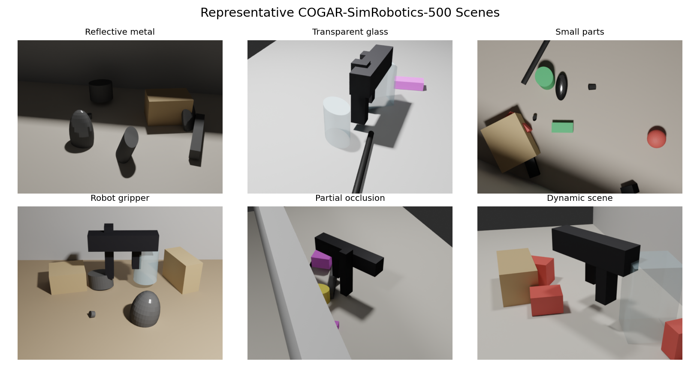
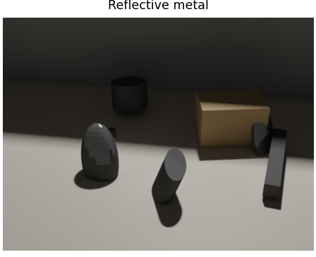
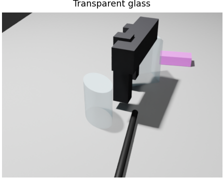
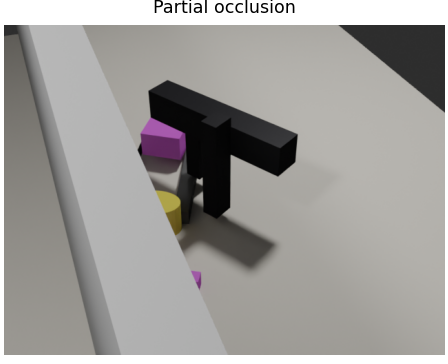
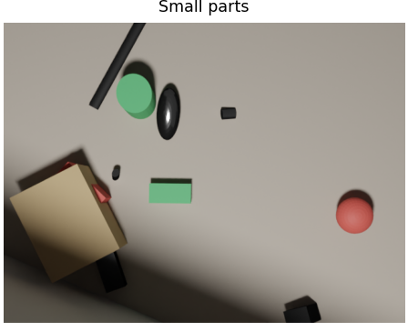
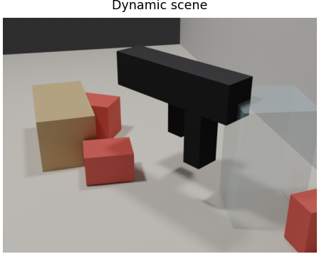
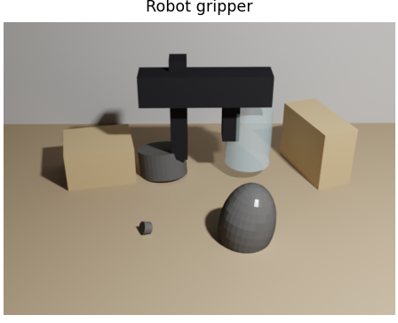
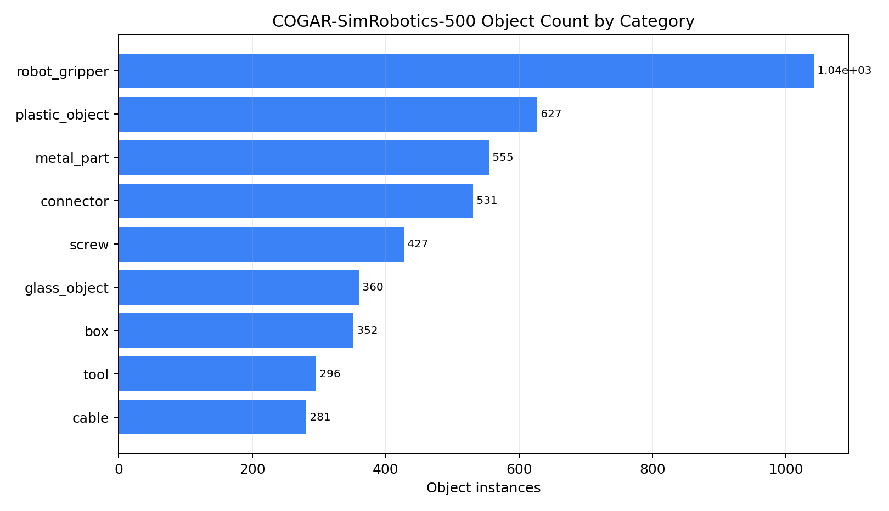
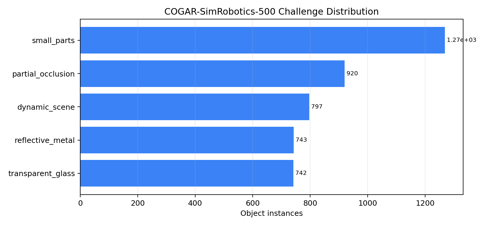
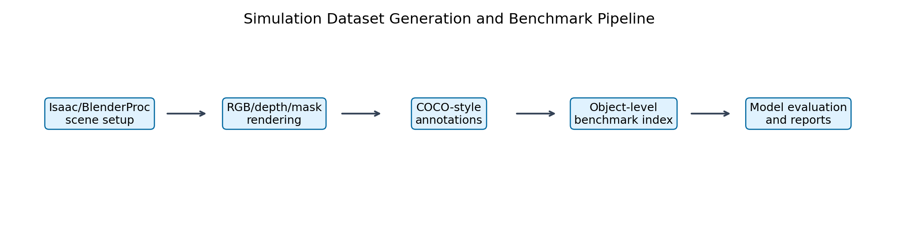

# COGAR-SimRobotics-500 Dataset Guide

This folder is the local dataset workspace for the simulated robotic-scene
benchmark. The repository tracks this README, but it does not track the full
raw dataset images and masks because they are large generated artifacts.

The main dataset for the assignment is:

```text
data/cogar_sim_500_final/
```

It is the frozen 500-image simulated dataset used for the final SAM-family,
FastSAM, MobileSAM, EfficientSAM, YOLOv8-seg, and Mask R-CNN benchmark runs.

## Visual Preview

The raw images are not committed to GitHub, so the repository keeps lightweight
preview figures under `outputs/figures/final_report/dataset/`. These figures
show the dataset content without requiring the full local payload.



Representative final scenes from the 500-image benchmark.

| Reflective metal | Transparent glass |
|---|---|
|  |  |

| Partial occlusion | Small parts |
|---|---|
|  |  |

| Dynamic scene | Robot gripper scene |
|---|---|
|  |  |



Object-instance counts by final benchmark category.



Object-instance counts by primary robotic challenge.



High-level dataset generation and filtering pipeline.

## Dataset Summary

| Property | Value |
|---|---:|
| Dataset name | COGAR-SimRobotics-500 |
| Simulation tool | BlenderProc |
| Final RGB images | 500 |
| Final object instances | 4,471 |
| Object categories | 9 |
| Robotic challenge groups | 5 |
| Image size | 640 x 480 |
| Main annotation index | `data/cogar_sim_500_final/annotations/sim_robotic_scenes_index_final_filtered.csv` |
| Main benchmark format | object-level instance segmentation |
| YOLO export | `data/yolo_cogar_sim_500_final/` |

The dataset was designed for promptable and automatic zero-shot segmentation:

- box prompts use `bbox_xmin`, `bbox_ymin`, `bbox_xmax`, `bbox_ymax`;
- point prompts use `point_x`, `point_y`;
- automatic mask generation uses `image_path` and compares predictions against
  `binary_mask_path`;
- category and challenge columns support per-category and per-challenge metrics.

## Challenge Coverage

The assignment requires reflective metal, transparent glass, partial occlusion,
small screws/connectors, and moving or dynamic scenes. The final filtered index
covers those requirements as follows:

| Required challenge | Dataset label | Object instances |
|---|---|---:|
| Reflective metal | `reflective_metal` | 743 |
| Transparent glass | `transparent_glass` | 742 |
| Partial occlusion | `partial_occlusion` | 920 |
| Small screws/connectors | `small_parts` | 1,269 |
| Moving/dynamic layouts | `dynamic_scene` | 797 |

The final object-level challenge flags are:

| Flag | Count |
|---|---:|
| Reflective objects | 851 |
| Transparent objects | 360 |
| Small-part objects | 958 |
| Occluded-scene objects | 3,187 |
| Dynamic-scene objects | 797 |

## Category Coverage

| Category | Object instances |
|---|---:|
| `robot_gripper` | 1,042 |
| `plastic_object` | 627 |
| `metal_part` | 555 |
| `connector` | 531 |
| `screw` | 427 |
| `glass_object` | 360 |
| `box` | 352 |
| `tool` | 296 |
| `cable` | 281 |

The generator also contains support surfaces such as tables, but table/support
surfaces are not final benchmark target objects in the filtered object index.

## Local Folder Meanings

Four dataset folders may exist locally. They are not equivalent.

| Folder | Meaning | Use it for |
|---|---|---|
| `data/cogar_sim_500/` | Working generation and normalization area. It can contain raw BlenderProc candidates, normalized RGB/masks, intermediate metadata, and debug outputs. | Regeneration, debugging, and candidate filtering. |
| `data/cogar_sim_500_v2/` | Older intermediate version from dataset iteration. | Historical comparison only. Do not use for final results. |
| `data/cogar_sim_500_final/` | Final cleaned 500-image benchmark dataset. | Main assignment dataset and all final benchmark evaluations. |
| `data/yolo_cogar_sim_500_final/` | YOLOv8-seg export derived from the final dataset. | YOLOv8-seg fine-tuning and evaluation. |

The final dataset should not be replaced casually. If
`data/cogar_sim_500_final/` changes, the reported benchmark results must be
rerun because the evaluation target has changed.

## OCID Dataset Scope

OCID is separate from this `data/` folder.

This project uses two dataset tracks:

| Dataset track | Role | Stored in Git? |
|---|---|---|
| COGAR-SimRobotics-500 | Main simulated 500-image benchmark required by Assignment Task 1. | Only this README and lightweight preview/report figures are tracked. Raw data stays local or in release assets. |
| OCID | External real-world massive robustness test used after the simulated benchmark. | Raw OCID is not tracked. Compact result CSVs/tables/reports may be tracked under `outputs/ocid_full/` and `docs/`. |

OCID should live outside the repository or under an ignored local dataset path,
for example:

```text
/mnt/Info/COGAR_DATASETs/OCID-dataset
/mnt/cogar/datasets/OCID-dataset
C:\Amir\OCID-dataset
```

The OCID benchmark does not replace Task 1. It supports the later robustness
and domain-gap discussion by testing the same evaluation scripts on a larger
external dataset. The OCID deliverables are:

```text
docs/ocid_massive_benchmark_report.md
outputs/ocid_full/indexes/*.csv
outputs/ocid_full/results/*.csv
outputs/ocid_full/tables/*.csv
outputs/logs/ocid_aws_full_*.log
```

Do not package OCID inside the COGAR-SimRobotics-500 release assets. Keep OCID
external and cite it separately in the report.

## Final Dataset Layout

Expected local structure:

```text
data/cogar_sim_500_final/
  annotations/
    instances_all.json
    sim_robotic_scenes_index_final.csv
    sim_robotic_scenes_index_final_filtered.csv
    sim_robotic_scenes_index_vit_h_cpu_25.csv
  instance_masks/
    final/
      ann_*.png
  metadata/
    categories.json
    frame_index.csv
  rgb/
    000000.png
    000001.png
    ...
  splits/
    train.txt
    val.txt
    test.txt
```

Important files:

| File | Purpose |
|---|---|
| `annotations/instances_all.json` | COCO-style annotation file derived from the simulation/normalization pipeline. |
| `annotations/sim_robotic_scenes_index_final_filtered.csv` | Main object-level benchmark index used by final evaluation scripts. |
| `metadata/categories.json` | Category ID/name metadata. |
| `metadata/frame_index.csv` | Frame-level metadata, split labels, and challenge assignments. |
| `rgb/*.png` | Final RGB images. |
| `instance_masks/final/*.png` | Per-object binary masks. |
| `splits/*.txt` | Train/validation/test split files. |

## Main Index Columns

The main index is one row per object instance:

```text
data/cogar_sim_500_final/annotations/sim_robotic_scenes_index_final_filtered.csv
```

Core columns:

| Column | Meaning |
|---|---|
| `image_id`, `file_name`, `image_path` | Locate the RGB image. |
| `binary_mask_path` | Locate the per-object ground-truth mask. |
| `category_id`, `category_name` | Category labels for per-category metrics. |
| `object_id` | Object instance identifier. |
| `bbox_xmin`, `bbox_ymin`, `bbox_xmax`, `bbox_ymax` | Box prompt and bbox evaluation fields. |
| `point_x`, `point_y` | Point prompt fields. |
| `challenge_primary`, `challenge_secondary` | Robotic challenge labels. |
| `is_reflective`, `is_transparent`, `is_occluded`, `is_small_part`, `is_dynamic` | Challenge flags. |
| `area` | Ground-truth mask area in pixels. |
| `split` | `train`, `val`, or `test`. |

## How The Dataset Was Generated

Generation was done with BlenderProc using:

```text
configs/blenderproc_dataset.yaml
scripts/blenderproc/generate_cogar_sim_500.py
```

Key generation settings:

| Setting | Value |
|---|---:|
| Image width | 640 |
| Image height | 480 |
| Random seed | 42 |
| Render samples | 32 |
| Final base scenes | 50 |
| Final captures per scene | 10 |
| Candidate images generated | 650 |
| Final clean images after audit/filtering | 500 |

The final benchmark was built as:

1. Generate more candidates than needed.
2. Normalize RGB images, masks, metadata, and COCO annotations.
3. Build an object-level index.
4. Export per-object binary masks.
5. Audit the dataset for bad or unusable frames.
6. Filter down to exactly 500 clean images.
7. Freeze `data/cogar_sim_500_final/` as the benchmark dataset.
8. Derive `data/yolo_cogar_sim_500_final/` from the frozen final dataset.

## Rebuild Commands

Only use these commands when intentionally rebuilding the dataset. Rebuilding
changes the benchmark target unless the same frozen final data is restored.

Generate BlenderProc candidates:

```bash
source ~/blenderproc_test/.venv/bin/activate

blenderproc run scripts/blenderproc/generate_cogar_sim_500.py \
  --config configs/blenderproc_dataset.yaml \
  --num-images 650 \
  --raw-dataset-name pilot_v5_650_final_candidates
```

Normalize generated data:

```bash
PYTHONPATH=src python scripts/dataset/normalize_cogar_sim_500.py
```

Create an object index:

```bash
PYTHONPATH=src python scripts/dataset/create_object_index.py \
  --dataset cogar_sim_500 \
  --coco data/cogar_sim_500/annotations/instances_all.json \
  --metadata data/cogar_sim_500/metadata/frame_index.csv \
  --rgb-dir data/cogar_sim_500/rgb \
  --output outputs/indexes/cogar_sim_500_objects.csv
```

Export binary masks:

```bash
PYTHONPATH=src python scripts/dataset/export_binary_masks.py \
  --index outputs/indexes/cogar_sim_500_objects.csv \
  --output-dir data/cogar_sim_500/instance_masks/all
```

Validate the final index:

```bash
PYTHONPATH=src python scripts/dataset/validate_sim_index.py \
  --index data/cogar_sim_500_final/annotations/sim_robotic_scenes_index_final_filtered.csv
```

Audit the final index:

```bash
PYTHONPATH=src python scripts/dataset/audit_sim_dataset.py \
  --index data/cogar_sim_500_final/annotations/sim_robotic_scenes_index_final_filtered.csv \
  --output-dir outputs/tables/dataset_audit_final
```

Create the YOLOv8-seg export:

```bash
PYTHONPATH=src python scripts/baselines/prepare_yolo_seg_dataset.py \
  --index data/cogar_sim_500_final/annotations/sim_robotic_scenes_index_final_filtered.csv \
  --output-dir data/yolo_cogar_sim_500_final
```

## Quick Local Checks

Check that the final dataset exists:

```bash
test -f data/cogar_sim_500_final/annotations/sim_robotic_scenes_index_final_filtered.csv
test -d data/cogar_sim_500_final/rgb
test -d data/cogar_sim_500_final/instance_masks/final
```

Check image and object counts:

```bash
python - <<'PY'
import pandas as pd
idx = pd.read_csv("data/cogar_sim_500_final/annotations/sim_robotic_scenes_index_final_filtered.csv")
print("images:", idx["image_id"].nunique())
print("objects:", len(idx))
print(idx["challenge_primary"].value_counts())
print(idx["category_name"].value_counts())
PY
```

Expected output:

```text
images: 500
objects: 4471
```

## GitHub Policy

Only this README and lightweight preview/report figures should be tracked in
Git. The raw local dataset folders remain ignored because they contain generated
RGB images, masks, COCO files, and training exports.

Tracked:

- `data/README.md`
- source code and configs needed to regenerate the dataset
- lightweight preview figures already used by the reports
- dataset documentation under `docs/`

Ignored:

- `data/cogar_sim_500/`
- `data/cogar_sim_500_v2/`
- `data/cogar_sim_500_final/`
- `data/yolo_cogar_sim_500_final/`
- checkpoints, model weights, raw masks, and temporary experiment dumps

For sharing the frozen dataset, use compressed GitHub Release assets rather
than committing the raw folders directly to Git.

## Packaging The Frozen Dataset

The raw dataset is useful for a professor, reviewer, or client, but it should
not be committed directly to Git. Package it as compressed release assets and
upload those files to a GitHub Release.

Current local payload size:

| Local folder | Approximate size | Purpose |
|---|---:|---|
| `data/cogar_sim_500_final/` | 199 MB | Full frozen benchmark dataset with RGB images, masks, annotations, metadata, and splits. |
| `data/yolo_cogar_sim_500_final/` | 4 MB | YOLOv8-seg export derived from the frozen benchmark dataset. |

Recommended release asset names:

| Archive | Contains |
|---|---|
| `COGAR-SimRobotics-500_dataset.tar.gz` | `data/cogar_sim_500_final/` |
| `COGAR-SimRobotics-500_yolov8seg_export.tar.gz` | `data/yolo_cogar_sim_500_final/` |
| `SHA256SUMS.txt` | Checksums for both archives. |

Create the archives outside the repository:

```bash
bash scripts/dataset/package_release_datasets.sh
```

The script writes archives, checksums, and a release-notes template to:

```text
/tmp/cogar_dataset_release
```

Check the package plan without creating archives:

```bash
bash scripts/dataset/package_release_datasets.sh --dry-run
```

Full packaging instructions are in:

```text
docs/dataset_release.md
```

Do not put the archives under Git control. The repository `.gitignore` ignores
release archives and local release-asset folders, but using
`/tmp/cogar_dataset_release` keeps the working tree cleaner.

Recommended GitHub Release:

| Field | Suggested value |
|---|---|
| Tag | `v1.0-cogar-sim-dataset` |
| Title | `COGAR-SimRobotics-500 Dataset Release` |
| Assets | the two `.tar.gz` archives plus `SHA256SUMS.txt` |
| Release notes | include image count, object count, categories, challenge groups, and extraction command. |

A reviewer can extract the full dataset after downloading the release assets:

```bash
mkdir -p data
tar -C data -xzf COGAR-SimRobotics-500_dataset.tar.gz
tar -C data -xzf COGAR-SimRobotics-500_yolov8seg_export.tar.gz
```

Then verify the extracted dataset:

```bash
test -f data/cogar_sim_500_final/annotations/sim_robotic_scenes_index_final_filtered.csv
test -d data/cogar_sim_500_final/rgb
test -d data/cogar_sim_500_final/instance_masks/final
test -f data/yolo_cogar_sim_500_final/cogar_sim_500_yolov8seg.yaml
```

The expected final counts are:

```text
COGAR-SimRobotics-500 images: 500
COGAR-SimRobotics-500 object instances: 4,471
YOLO export: derived from the same frozen 500-image dataset
```

Do not include these folders in the release package:

- `data/cogar_sim_500/`, because it is the working/candidate generation area.
- `data/cogar_sim_500_v2/`, because it is an older intermediate version.
- OCID, because it is an external dataset and should be distributed separately.
- `checkpoints/`, because model weights are separate dependencies.
- `outputs/`, because compact benchmark outputs are already tracked or can be
  downloaded from the repository.

## Related Dataset Reports

The full assignment narrative is in `docs/`. This README stays focused on the
dataset files and generation process.

- `docs/assignment_task1_dataset_completion.md`
- `docs/final_dataset_summary.md`
- `docs/blenderproc_cogar_sim_500.md`
- `docs/dataset_quality_workflow.md`
- `docs/dataset_release.md`
- `docs/ocid_massive_benchmark_report.md`
