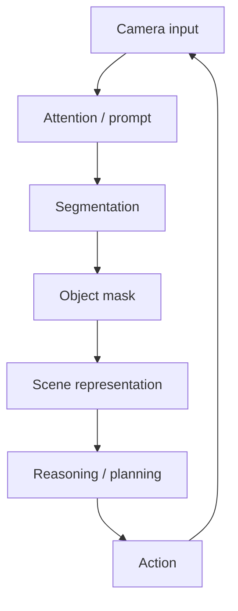

# Cognitive Approach

The COGAR interpretation is that segmentation is a perception module inside a
robotic cognitive architecture.

COGAR mapping:

| Concept | Benchmark interpretation |
|---|---|
| Embodiment | Unitree G1 robot-centered scenes. |
| Situated perception | Clutter, occlusion, material effects, and dynamic scenes. |
| Attention | Point and box prompts. |
| Object representation | Segmentation masks. |
| Perception-action loop | FPS and latency determine whether masks are timely. |
| Failure awareness | Challenge-group and qualitative failure analysis. |

Main statement:

> A segmentation model is useful for robotics only if its masks are accurate,
> robust, fast enough, and meaningful for downstream robot decisions.

More detail:

- [../../report/04_cognitive_approach.md](../../report/04_cognitive_approach.md)
- [../../REPORT.md#4-cognitive-approach](../../REPORT.md#4-cognitive-approach)
