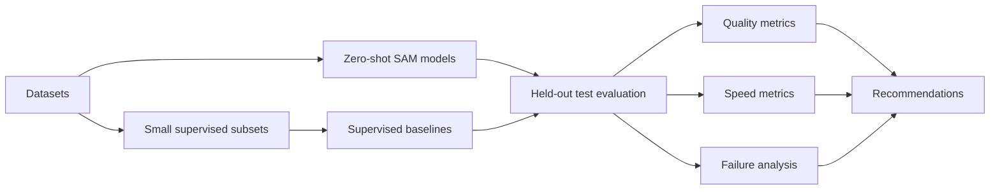

# Methodology

The project is formulated as a benchmark over datasets, model families, prompt
modes, metrics, challenge groups, and hardware.

Datasets:

| Dataset | Images | Role |
|---|---:|---|
| Isaac official Unitree G1 | 1000 | Main robot-centered simulation benchmark. |
| BlenderProc COGAR-SimRobotics-1000 | 1000 | Controlled synthetic challenge benchmark. |
| OCID | 2390 | Real clutter/domain-gap reference. |

Models:

- zero-shot: SAM ViT-H, SAM ViT-B, SAM2 Hiera-Large, FastSAM-X;
- lightweight: MobileSAM ViT-T, EfficientSAM-Ti, EfficientSAM-S;
- supervised: YOLOv8-seg, Mask R-CNN, DeepLabV3+.

Fairness rules:

- final comparisons use held-out test images;
- supervised validation images are used only for checkpoint selection;
- point/box prompts are reported as oracle-prompt evaluations;
- automatic mask generation is treated separately from target-prompted masks.

More detail:

- [../../report/03_research_formulation.md](../../report/03_research_formulation.md)
- [../../REPORT.md#3-research-formulation](../../REPORT.md#3-research-formulation)
