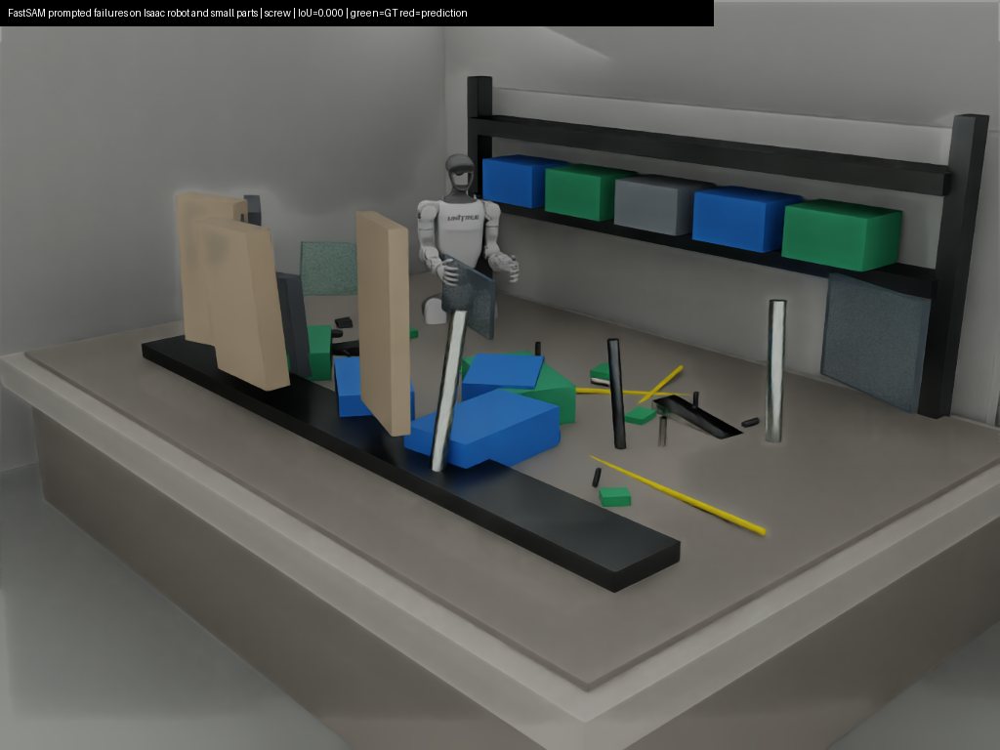
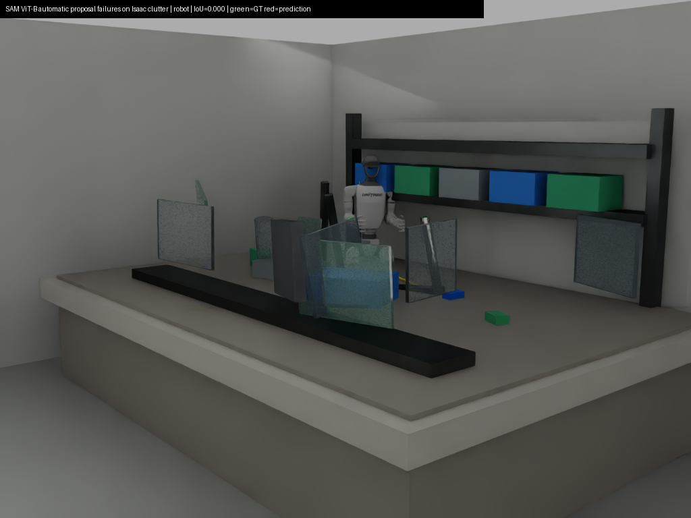
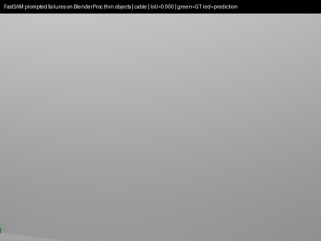
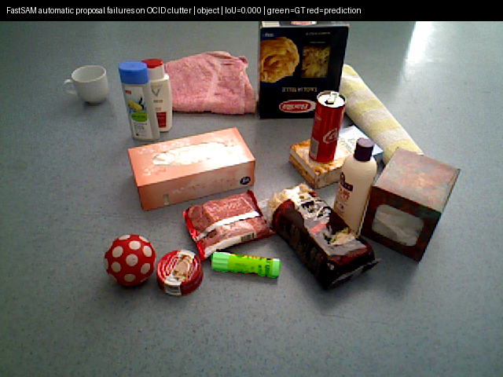

# Task 8 - Failure Mode Analysis

> The complete raw `results/` folder could not be included in Git because it is
> too large. This committed analysis contains the derived metrics and selected
> visual failures; full prediction files remain on the benchmark machine/AWS
> storage.

This report summarizes where the segmentation models fail in the robotic scenes, using Task 6 metrics and representative visual overlays mined from Task 4 predictions.

## Key Findings

- Box prompts are consistently stronger than point prompts for SAM-family models; the mean box-minus-point mIoU gap is 0.173.
- Automatic mask generation has lower AP than box prompting because proposals are class-agnostic and duplicate/merge objects; mean AP is 0.356 versus 0.678 for box prompts.
- The weakest categories are concentrated in small/rare parts and robot-body masks: rubber_part (deeplabv3plus), rubber_part (yolo8_seg), robot (sam2_hiera_large), robot (fastsam_x), robot (sam_vit_b).
- Real-time GPU feasibility is mainly with supervised/lightweight models: deeplabv3plus, mask_rcnn, yolo8_seg reach at least 10 FPS in one or more settings.
- Small-subset supervised baselines improve scene-specific object consistency, but semantic DeepLabV3+ does not provide instance AP and therefore is not a full replacement for instance segmentation.

## Lowest Zero-Shot Categories

| dataset | model | prompt_mode | category | iou | boundary_f1 | count |
| --- | --- | --- | --- | --- | --- | --- |
| isaac_official_unitree_g1 | sam2_hiera_large | automatic | robot | 0.053 | 0.099 | 19242 |
| isaac_official_unitree_g1 | fastsam_x | point | robot | 0.063 | 0.121 | 19242 |
| isaac_official_unitree_g1 | sam_vit_b | automatic | robot | 0.083 | 0.135 | 19242 |
| isaac_official_unitree_g1 | sam_vit_b | automatic | cable | 0.135 | 0.198 | 3453 |
| isaac_official_unitree_g1 | sam_vit_b | automatic | screw | 0.150 | 0.214 | 7898 |
| isaac_official_unitree_g1 | sam2_hiera_large | automatic | cable | 0.152 | 0.237 | 3453 |
| isaac_official_unitree_g1 | fastsam_x | box | robot | 0.155 | 0.249 | 19242 |
| isaac_official_unitree_g1 | sam_vit_h | automatic | robot | 0.157 | 0.230 | 19242 |
| isaac_official_unitree_g1 | fastsam_x | automatic | robot | 0.158 | 0.245 | 19242 |
| isaac_official_unitree_g1 | sam2_hiera_large | automatic | screw | 0.179 | 0.249 | 7898 |
| blenderproc_cogar_sim | fastsam_x | point | robot_gripper | 0.192 | 0.228 | 1633 |
| blenderproc_cogar_sim | fastsam_x | point | screw | 0.201 | 0.239 | 674 |
| isaac_official_unitree_g1 | sam_vit_h | point | robot | 0.212 | 0.307 | 19242 |
| isaac_official_unitree_g1 | sam2_hiera_large | point | robot | 0.222 | 0.325 | 19242 |
| isaac_official_unitree_g1 | sam_vit_h | automatic | screw | 0.234 | 0.328 | 7898 |

## Lowest Baseline Categories

| dataset | model | category | iou | boundary_f1 | count |
| --- | --- | --- | --- | --- | --- |
| isaac_official_unitree_g1 | deeplabv3plus | rubber_part | 0.012 | 0.031 |  |
| isaac_official_unitree_g1 | yolo8_seg | rubber_part | 0.022 | 0.039 | 95 |
| isaac_official_unitree_g1 | yolo8_seg | sensor_module | 0.149 | 0.168 | 68 |
| isaac_official_unitree_g1 | yolo8_seg | tool | 0.223 | 0.264 | 85 |
| isaac_official_unitree_g1 | deeplabv3plus | screw | 0.230 | 0.483 |  |
| isaac_official_unitree_g1 | yolo8_seg | cable | 0.244 | 0.394 | 153 |
| blenderproc_cogar_sim | deeplabv3plus | screw | 0.262 | 0.223 |  |
| isaac_official_unitree_g1 | mask_rcnn | rubber_part | 0.316 | 0.375 | 95 |
| isaac_official_unitree_g1 | mask_rcnn | cable | 0.349 | 0.504 | 153 |
| isaac_official_unitree_g1 | mask_rcnn | screw | 0.351 | 0.478 | 372 |
| isaac_official_unitree_g1 | deeplabv3plus | tool | 0.354 | 0.337 |  |
| isaac_official_unitree_g1 | deeplabv3plus | cable | 0.368 | 0.584 |  |
| isaac_official_unitree_g1 | yolo8_seg | screw | 0.368 | 0.553 | 372 |
| isaac_official_unitree_g1 | deeplabv3plus | sensor_module | 0.389 | 0.361 |  |
| isaac_official_unitree_g1 | yolo8_seg | robot | 0.393 | 0.570 | 955 |

## Weakest Challenge Groups

| run_type | dataset | model | prompt_mode | challenge_group | weighted_iou | mean_boundary_f1 |
| --- | --- | --- | --- | --- | --- | --- |
| zero_shot | isaac_official_unitree_g1 | fastsam_x | point | robot_and_occlusion | 0.174 | 0.576 |
| zero_shot | isaac_official_unitree_g1 | sam2_hiera_large | automatic | robot_and_occlusion | 0.181 | 0.611 |
| zero_shot | blenderproc_cogar_sim | fastsam_x | point | robot_and_occlusion | 0.192 | 0.228 |
| zero_shot | isaac_official_unitree_g1 | sam_vit_b | automatic | robot_and_occlusion | 0.209 | 0.629 |
| zero_shot | blenderproc_cogar_sim | fastsam_x | point | small_parts_thin_structures | 0.245 | 0.299 |
| zero_shot | isaac_official_unitree_g1 | fastsam_x | box | robot_and_occlusion | 0.269 | 0.690 |
| zero_shot | isaac_official_unitree_g1 | sam_vit_h | automatic | robot_and_occlusion | 0.276 | 0.681 |
| zero_shot | isaac_official_unitree_g1 | fastsam_x | automatic | robot_and_occlusion | 0.278 | 0.703 |
| zero_shot | isaac_official_unitree_g1 | sam_vit_b | automatic | small_parts_thin_structures | 0.278 | 0.383 |
| zero_shot | isaac_official_unitree_g1 | sam2_hiera_large | automatic | small_parts_thin_structures | 0.295 | 0.401 |
| zero_shot | blenderproc_cogar_sim | fastsam_x | point | transparent_reflective_surfaces | 0.317 | 0.342 |
| zero_shot | isaac_official_unitree_g1 | sam_vit_h | point | robot_and_occlusion | 0.324 | 0.723 |
| zero_shot | blenderproc_cogar_sim | fastsam_x | point | other | 0.327 | 0.346 |
| zero_shot | isaac_official_unitree_g1 | sam2_hiera_large | point | robot_and_occlusion | 0.334 | 0.736 |
| baseline | isaac_official_unitree_g1 | yolo8_seg | inference | small_parts_thin_structures | 0.339 | 0.348 |
| baseline | isaac_official_unitree_g1 | deeplabv3plus | inference | small_parts_thin_structures | 0.344 | 0.430 |
| zero_shot | isaac_official_unitree_g1 | fastsam_x | point | small_parts_thin_structures | 0.365 | 0.502 |
| zero_shot | isaac_official_unitree_g1 | sam_vit_h | automatic | small_parts_thin_structures | 0.376 | 0.507 |
| zero_shot | isaac_official_unitree_g1 | sam_vit_b | point | robot_and_occlusion | 0.379 | 0.753 |
| baseline | isaac_official_unitree_g1 | mask_rcnn | inference | small_parts_thin_structures | 0.431 | 0.531 |

## Prompt Sensitivity

| dataset | model | point_mIoU | box_mIoU | automatic_mIoU | box_minus_point |
| --- | --- | --- | --- | --- | --- |
| blenderproc_cogar_sim | fastsam_x | 0.325 | 0.748 | 0.799 | 0.423 |
| ocid | fastsam_x | 0.485 | 0.764 | 0.798 | 0.279 |
| ocid | sam_vit_b | 0.616 | 0.834 | 0.731 | 0.218 |
| ocid | sam_vit_h | 0.665 | 0.845 | 0.838 | 0.181 |
| isaac_official_unitree_g1 | sam_vit_h | 0.574 | 0.752 | 0.486 | 0.178 |
| isaac_official_unitree_g1 | sam_vit_b | 0.602 | 0.742 | 0.389 | 0.140 |
| isaac_official_unitree_g1 | sam2_hiera_large | 0.595 | 0.714 | 0.381 | 0.119 |
| blenderproc_cogar_sim | sam_vit_h | 0.804 | 0.923 | 0.878 | 0.118 |
| blenderproc_cogar_sim | sam_vit_b | 0.788 | 0.904 | 0.815 | 0.116 |
| ocid | sam2_hiera_large | 0.759 | 0.866 | 0.794 | 0.107 |
| isaac_official_unitree_g1 | fastsam_x | 0.383 | 0.484 | 0.523 | 0.101 |
| blenderproc_cogar_sim | sam2_hiera_large | 0.827 | 0.919 | 0.802 | 0.092 |

## Representative Visual Failures

Overlay convention: green = ground truth only, red = prediction only, yellow = overlap.

| case_label | dataset | model | prompt_mode | category | iou | figure |
| --- | --- | --- | --- | --- | --- | --- |
| FastSAM prompted failures on Isaac robot and small parts | isaac_official_unitree_g1 | fastsam_x | point | screw | 0.000 | outputs/task8_failure_analysis/figures/01_01_isaac_official_unitree_g1_fastsam_x_point_screw_iou_0.000.png |
| FastSAM prompted failures on Isaac robot and small parts | isaac_official_unitree_g1 | fastsam_x | point | cable | 0.000 | outputs/task8_failure_analysis/figures/01_02_isaac_official_unitree_g1_fastsam_x_point_cable_iou_0.000.png |
| SAM ViT-B automatic proposal failures on Isaac clutter | isaac_official_unitree_g1 | sam_vit_b | automatic | screw | 0.000 | outputs/task8_failure_analysis/figures/02_01_isaac_official_unitree_g1_sam_vit_b_automatic_screw_iou_0.000.png |
| SAM ViT-B automatic proposal failures on Isaac clutter | isaac_official_unitree_g1 | sam_vit_b | automatic | robot | 0.000 | outputs/task8_failure_analysis/figures/02_02_isaac_official_unitree_g1_sam_vit_b_automatic_robot_iou_0.000.png |
| FastSAM prompted failures on BlenderProc thin objects | blenderproc_cogar_sim | fastsam_x | point | screw | 0.000 | outputs/task8_failure_analysis/figures/03_01_blenderproc_cogar_sim_fastsam_x_point_screw_iou_0.000.png |
| FastSAM prompted failures on BlenderProc thin objects | blenderproc_cogar_sim | fastsam_x | point | cable | 0.000 | outputs/task8_failure_analysis/figures/03_02_blenderproc_cogar_sim_fastsam_x_point_cable_iou_0.000.png |
| SAM ViT-H automatic glass and small-part failures on BlenderProc | blenderproc_cogar_sim | sam_vit_h | automatic | screw | 0.000 | outputs/task8_failure_analysis/figures/04_01_blenderproc_cogar_sim_sam_vit_h_automatic_screw_iou_0.000.png |
| SAM ViT-H automatic glass and small-part failures on BlenderProc | blenderproc_cogar_sim | sam_vit_h | automatic | glass_object | 0.000 | outputs/task8_failure_analysis/figures/04_02_blenderproc_cogar_sim_sam_vit_h_automatic_glass_object_iou_0.000.png |
| FastSAM automatic proposal failures on OCID clutter | ocid | fastsam_x | automatic | object | 0.000 | outputs/task8_failure_analysis/figures/05_01_ocid_fastsam_x_automatic_object_iou_0.000.png |
| FastSAM automatic proposal failures on OCID clutter | ocid | fastsam_x | automatic | object | 0.000 | outputs/task8_failure_analysis/figures/05_02_ocid_fastsam_x_automatic_object_iou_0.000.png |

### Visual Overlays

**FastSAM prompted failures on Isaac robot and small parts - screw**

**SAM ViT-B automatic proposal failures on Isaac clutter - robot**

**FastSAM prompted failures on BlenderProc thin objects - cable**

**SAM ViT-H automatic glass and small-part failures on BlenderProc - glass object**

**FastSAM automatic proposal failures on OCID clutter - object**

## Interpretation

- Small screws, connectors, cables, rubber parts, and sensor modules fail because their masks are small, thin, or visually similar to nearby fixtures. A minor boundary error can dominate IoU for these categories.
- Transparent and reflective objects are sensitive to missing visual edges, specular highlights, and background bleed-through. Box prompts help, but automatic proposal generation often merges glass with the surface behind it.
- Robot and occlusion failures are common when articulated robot parts touch tools, bins, or the workbench. FastSAM often returns coarse object proposals, while SAM variants need stronger prompts to isolate the correct part.
- Automatic mask generation is useful for open-set proposal discovery, but in cluttered robotic scenes it creates duplicates and class-agnostic masks that do not align well with instance categories.
- Supervised baselines trained on the small subset adapt well to the dataset domain, but they inherit the weaknesses of limited labels: rare small parts remain weak, and DeepLabV3+ cannot separate individual instances.
