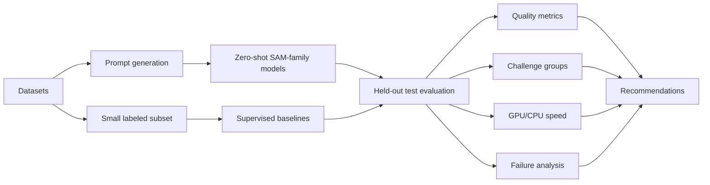

# Research Formulation

Project: **Foundation Model Segmentation for Robotic Scenes**  
Assignment: **Zero-Shot Segmentation Benchmark for Robotic Perception (Simulation)**  
Student id: **5884715**

This file supports the **Research Formulation** section in
[`REPORT.md`](../REPORT.md). It defines the objectives, hypotheses,
experimental variables, methodology, fairness rules, and evidence mapping.

For reusable plots and summary tables, use
[`figures_and_tables.md`](figures_and_tables.md).

---

## 1. Research Question

> Can promptable foundation segmentation models provide reliable zero-shot
> object masks for robotic perception in challenging simulated scenes, and how
> do they compare with lightweight and supervised segmentation models in terms
> of accuracy, robustness, and real-time feasibility?

---

## 2. Objectives

| Objective | Description |
|---|---|
| O1 | Create or curate robotic-scene datasets with synthetic and real cluttered examples. |
| O2 | Evaluate SAM, SAM2, FastSAM, MobileSAM, and EfficientSAM in zero-shot mode. |
| O3 | Compare point prompts, box prompts, and automatic mask generation. |
| O4 | Train YOLOv8-seg, Mask R-CNN, and DeepLabV3+ on small labeled subsets. |
| O5 | Measure segmentation quality with mIoU, boundary F1, mask AP, and per-category/challenge metrics. |
| O6 | Measure GPU and CPU FPS/latency for deployment feasibility. |
| O7 | Analyze qualitative failure modes and produce task-dependent recommendations. |

---

## 3. Hypotheses

| ID | Hypothesis |
|---|---|
| H1 | Prompted modes should generally outperform automatic mask generation because target cues reduce ambiguity. |
| H2 | Box prompts should generally outperform point prompts because boxes provide stronger spatial constraints. |
| H3 | Heavy SAM/SAM2 models should provide strong quality but weak real-time feasibility. |
| H4 | Lightweight SAM variants should improve deployment trade-offs but may reduce quality. |
| H5 | Supervised baselines can be more practical for real-time control when labeled target-domain data exists. |
| H6 | Transparent, reflective, occluded, small, thin, and robot-body cases should remain high-risk failure modes. |

---

## 4. Experimental Design

| Dimension | Values |
|---|---|
| Datasets | Isaac Unitree G1, BlenderProc COGAR-SimRobotics-1000, OCID |
| Heavy zero-shot models | SAM ViT-H, SAM ViT-B, SAM2 Hiera-Large, FastSAM-X |
| Lightweight models | MobileSAM ViT-T, EfficientSAM-Ti, EfficientSAM-S |
| Supervised baselines | YOLOv8-seg, Mask R-CNN, DeepLabV3+ |
| Prompt modes | point, box, automatic |
| Devices | CUDA GPU and CPU |
| Metrics | mIoU, boundary F1, mask AP/AP50/AP75, per-category IoU, challenge-group IoU, FPS, latency |

---

## 5. Dataset and Split Policy

| Dataset | Train | Validation | Held-out test | Role |
|---|---:|---:|---:|---|
| Isaac official Unitree G1 | 100 | 50 | 850 | Main robot-centered simulation benchmark. |
| BlenderProc COGAR-SimRobotics-1000 | 100 | 50 | 850 | Controlled synthetic challenge benchmark. |
| OCID | 100 | 50 | 2240 | Real clutter/domain-gap reference. |

The 50-image validation subsets are used only for supervised checkpoint
selection. Final comparisons use the held-out test split. This prevents
supervised baselines from being compared on the same images used for model
selection.

---

## 6. Prompting Policy

| Prompt mode | How it is evaluated | Robotic interpretation |
|---|---|---|
| Point | Foreground point from the target mask. | Minimal attention cue. |
| Box | COCO bounding box from the target annotation. | Strong target cue from detector, tracker, planner, or human. |
| Automatic | No target-specific prompt. | Bottom-up object proposal generation. |

Point and box prompts are oracle prompts. They measure mask quality once a
target cue exists; they do not solve prompt generation.

---

## 7. Fairness Rules

| Rule | Decision |
|---|---|
| Zero-shot separation | SAM-family models are not fine-tuned on the benchmark datasets. |
| Supervised separation | Baselines use train/validation data, but final reporting uses held-out test data. |
| Prompt transparency | Point/box results are described as oracle-prompt evaluations. |
| Automatic separation | Automatic mask generation is not mixed with prompted target segmentation. |
| Runtime transparency | Highest quality and best speed-quality trade-off are reported separately. |

---

## 8. Research Question to Evidence Map

| Research question | Evidence |
|---|---|
| RQ1: mask quality | F2, F3, T1, T2 |
| RQ2: robotic robustness | F7, T5, T6, E1–E6 |
| RQ3: deployment feasibility | F5, T3 |
| RQ4: model-selection trade-off | F4, F5, F6, T2–T4 |

Figure/table IDs refer to [`figures_and_tables.md`](figures_and_tables.md).

---

## 9. Methodological Interpretation

The formulation is multi-dimensional because no single metric answers the
robotic question. mIoU and AP describe mask quality, boundary F1 describes edge
precision, challenge-group IoU describes robustness, and FPS/latency describe
whether a model can plausibly fit into an online robot loop.

The benchmark is therefore designed to support conditional conclusions:

- use heavy SAM/SAM2 when mask quality dominates and latency is acceptable;
- use supervised baselines when the domain is known and real-time operation is
  required;
- use MobileSAM/EfficientSAM only after checking the speed-quality trade-off;
- use automatic mask generation cautiously in cluttered robotic scenes;
- treat transparent, reflective, small, thin, occluded, and robot-body cases as
  high-risk categories.

---

## 10. Slide-Ready Summary

**Slide title:** Research Formulation

**Main message:** The project is formulated as a benchmark over datasets,
models, prompts, metrics, devices, and challenge groups.

**Recommended visuals:** pipeline diagram from this file, F2 zero-shot heatmap,
and F5 speed-quality scatter.

---

## 11. Links

- Final report section: [`REPORT.md#3-research-formulation`](../REPORT.md#3-research-formulation)
- Evidence catalog: [`figures_and_tables.md`](figures_and_tables.md)
- Results/congruence: [`05_results_congruence_and_conclusions.md`](05_results_congruence_and_conclusions.md)
