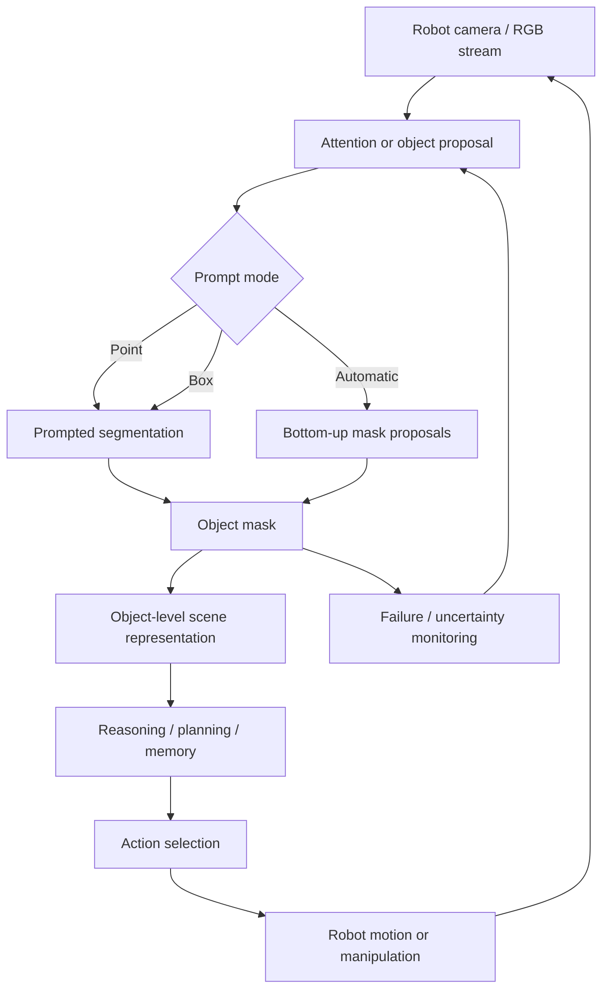

# Cognitive Approach

Project: **Foundation Model Segmentation for Robotic Scenes**  
Assignment: **Zero-Shot Segmentation Benchmark for Robotic Perception (Simulation)**  
Student id: **5884715**

This file supports the **Cognitive Approach** section in
[`REPORT.md`](../REPORT.md). It explains how the benchmark connects to
Cognitive Architectures for Robotics (COGAR).

For reusable plots and result tables, use
[`figures_and_tables.md`](figures_and_tables.md).

---

## 1. Core Idea

The cognitive approach is to treat segmentation as a **perception module**
inside an embodied robotic architecture, not as an isolated computer-vision
output.

In robotics, a mask can become:

- an attention target,
- an object-level scene representation,
- an input to grasp planning,
- a region for tracking,
- a cue for collision checking,
- a signal for uncertainty or failure monitoring.

Therefore, the benchmark evaluates whether segmentation models are accurate,
robust, fast, and interpretable enough to support later robot decisions.

---

## 2. Cognitive Architecture View

This loop is the reason the project evaluates more than mIoU. A mask that is
accurate but too slow, unstable, or unreliable on robotic materials may not be
useful for action.

---

## 3. Mapping to COGAR Concepts

| COGAR concept | Meaning in this project |
|---|---|
| Embodiment | The main simulation includes robot-centered Unitree G1 scenes. |
| Situated perception | The benchmark includes clutter, occlusion, transparent/reflective materials, dynamic objects, and robot-body visibility. |
| Attention | Point and box prompts represent task-driven focus on an object. |
| Object representation | Segmentation masks convert pixels into object-level regions. |
| Perception-action loop | Segmentation errors can affect grasping, tracking, navigation, and planning. |
| Real-time cognition | FPS and latency determine whether perception can run inside an online loop. |
| Resource-bounded cognition | MobileSAM and EfficientSAM test lower-compute alternatives. |
| Failure awareness | Challenge-group and qualitative failure analysis identify unsafe perception conditions. |

---

## 4. Prompt Modes as Cognitive Attention

| Prompt mode | Technical role | Cognitive interpretation |
|---|---|---|
| Point | One foreground point inside the target. | Minimal attentional cue: “focus here.” |
| Box | Approximate target extent. | Strong top-down cue from detector, tracker, planner, or human. |
| Automatic | No target cue. | Bottom-up object discovery. |

This distinction is central to the conclusion. Strong box-prompt results show
that SAM-family models can refine a target cue into a high-quality mask. They
do not prove that the robot can autonomously decide what to segment.

---

## 5. Evidence Used for the Cognitive Interpretation

| Cognitive claim | Evidence |
|---|---|
| Robotic scenes are embodied and situated. | F1 |
| Prompting behaves like task-driven attention. | F3, T1 |
| Mask reliability depends on context. | F2, T1 |
| Runtime affects perception-action feasibility. | F5, T3 |
| Lightweight models represent resource-bounded perception. | F6, T4 |
| Failures affect object representation and action safety. | F7, T5, E1–E6 |

Figure/table IDs refer to [`figures_and_tables.md`](figures_and_tables.md).

---

## 6. Cognitive Interpretation of Results

| Result pattern | Cognitive interpretation |
|---|---|
| SAM ViT-H box gives high quality but low FPS on synthetic datasets. | Strong deliberate perception, weak real-time loop suitability. |
| DeepLabV3+ and YOLOv8-seg reach real-time FPS after supervision. | A trained domain module can be better for fast closed-loop behavior. |
| MobileSAM box gives moderate/high quality at lower cost. | Useful for resource-bounded prompted perception. |
| Automatic modes are less controlled in difficult scenes. | Bottom-up object discovery remains harder than target-focused segmentation. |
| Small, transparent, reflective, and occluded objects fail frequently. | The perception module needs uncertainty checks before action. |

---

## 7. COGAR Claim to Use in the Report

> In this project, segmentation is treated as a cognitive interface between raw
> visual input and robot-level decision making. Point and box prompts correspond
> to task-driven attention, masks correspond to object-level representations,
> and speed/failure analysis determines whether those representations can be
> used safely inside a perception-action loop.

---

## 8. Slide-Ready Summary

**Slide title:** Cognitive Approach: Segmentation as a Perception Module

**Main message:** A segmentation model is useful for robotics only if its masks
are accurate, robust, fast enough, and meaningful for downstream robot
decisions.

**Recommended visuals:** cognitive architecture diagram from this file, F5
speed-quality scatter, and F7 challenge-group performance.

---

## 9. References

Full source details are maintained in [`references.md`](references.md).

- University of Genoa COGAR course page.
- Kotseruba and Tsotsos, cognitive architecture survey.
- Active perception and perception-action loop literature.
- SAM/SAM2 references for promptable segmentation as perception.

---

## 10. Links

- Final report section: [`REPORT.md#4-cognitive-approach`](../REPORT.md#4-cognitive-approach)
- Evidence catalog: [`figures_and_tables.md`](figures_and_tables.md)
- Results/congruence: [`05_results_congruence_and_conclusions.md`](05_results_congruence_and_conclusions.md)
